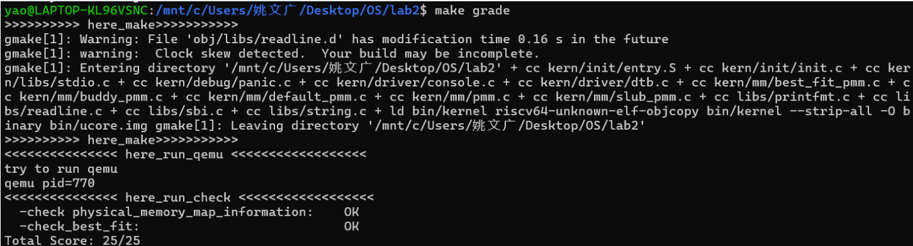
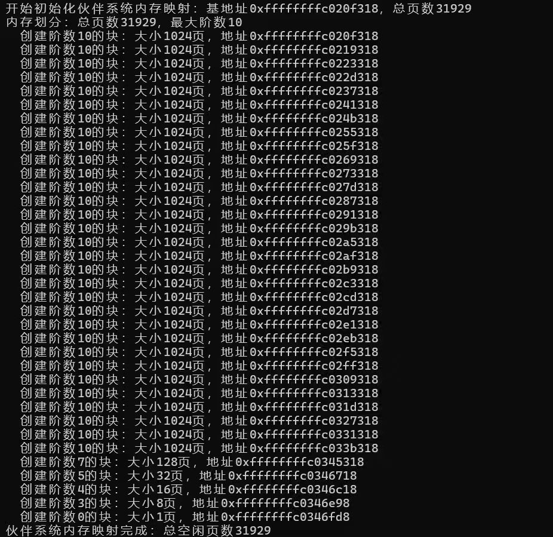
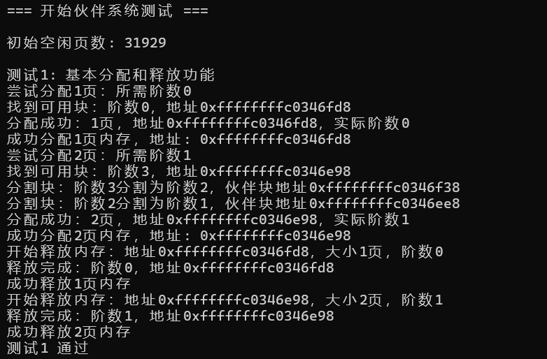
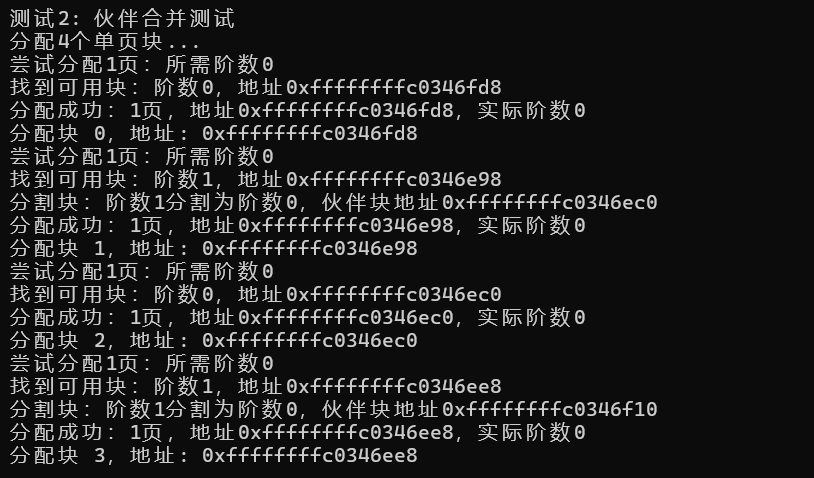
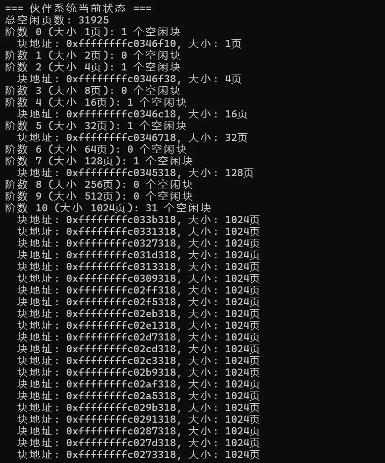
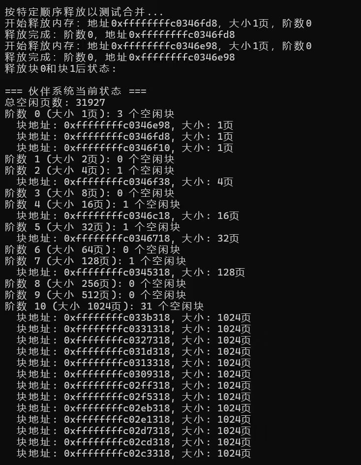
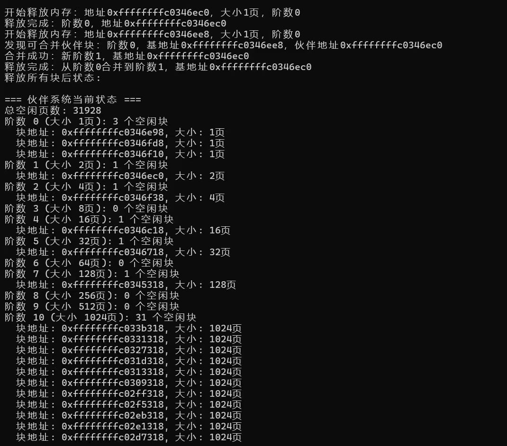
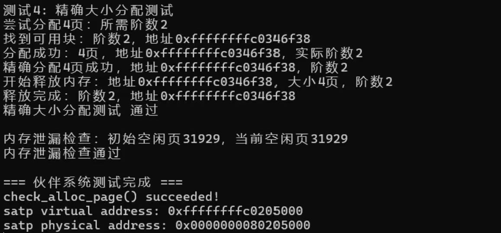
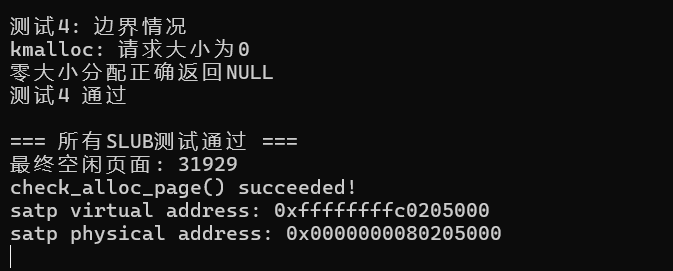

# 物理内存和页表

小组成员：陈忠镇  姚文广  田子煊

## 实验目的

- 理解页表的建立和使用方法
- 理解物理内存的管理方法
- 理解页面分配算法

## 实验过程

### 练习1：理解first-fit 连续物理内存分配算法(思考题)

#### 主要思想

first-fit 连续物理内存分配算法，维护一个空闲的块列表，当需要内存时，我们就找到对应的一块**内存最大**的空闲块，分配给对应的进程。

#### 实现过程

从空闲内存块的链表上查找**第一个**大小大于所需内存的块，分配出去，回收时会**按照地址从小到大的顺序插入链表**，并且**合并**与之**相邻且连续**的空闲内存块。

#### 代码分析

##### default_init

```c
static void
default_init(void) {
    list_init(&free_list);  // 初始化空闲链表为"自循环"的空链表
    nr_free = 0;            // 初始时无空闲页，计数设为0
}
```

**该函数用于初始化存放空闲块的链表，首先调用list_init函数，初始化一个空的双向链表free_list，然后定义了nr_free，也就是空闲块的个数定义为0**

##### default_init_memmap

```c
static void
default_init_memmap(struct Page *base, size_t n) {
    assert(n > 0);  // 断言：初始化的页数必须大于0（调试时检查参数合法性）
    struct Page *p = base;  // 临时指针，用于遍历待初始化的页面
    // 遍历从base到base+n-1的所有页面，重置状态
    for (; p != base + n; p ++) {
        assert(PageReserved(p));  // 断言：这些页面必须是"保留页"（未被使用）
        p->flags = 0;  // 重置页面标志位（清除所有状态标记）
        p->property = 0;  // 临时设为0（后续由base统一标记块大小）
        set_page_ref(p, 0);  // 重置页面引用计数为0（表示未被引用）
    }
    // 标记空闲块的起始页
    base->property = n;  // 记录当前空闲块包含n个连续页面
    SetPageProperty(base);  // 设置"空闲块起始页"标志（PageProperty）
    nr_free += n;  // 空闲页总数增加n

    // 将新空闲块按物理地址递增顺序插入free_list
    if (list_empty(&free_list)) {  // 若空闲链表为空
        list_add(&free_list, &(base->page_link));  // 直接将base的链表节点加入链表
    } else {  // 若链表非空，找合适位置插入（保持地址有序）
        list_entry_t* le = &free_list;  // 从链表头开始遍历
        // 遍历链表（双向循环链表，终止条件是回到表头）
        while ((le = list_next(le)) != &free_list) {
            // 将链表节点转换为对应的Page结构体（le2page宏：通过链表节点偏移量计算Page地址）
            struct Page* page = le2page(le, page_link);
            // 若当前base的物理地址小于链表中page的地址，说明应插入到page前面
            if (base < page) {
                list_add_before(le, &(base->page_link));  // 插入到page的链表节点前面
                break;  // 插入后退出循环
            } 
            // 若遍历到链表最后一个节点（下一个节点是表头），则插入到最后
            else if (list_next(le) == &free_list) {
                list_add(le, &(base->page_link));  // 插入到当前le后面（链表末尾）
            }
        }
    }
}
```

**该函数用于初始化一个空闲内存块**。参数base指向一个页面结构体数组的起始地址，代表一段连续的内存页面，也就是我们需要存放的数组；后面的参数n就是我们需要进行初始化的页面数量。

首先我们判定n是否大于0，如果为0就不需要存放。

然后定义一个指针p指向Page结构体，并将其初始化为指向base所指向的内存地址。接着通过for循环遍历存放的每一个页面。遍历时先判定该页面是否为保留页面，是的话就将该页面的flags和property属性和页面的引用次数统统初始化为0。

最后将首个页面的property属性设置为n，以及更新nr_free的数量。

后面用if函数用于判断该列表是否为空。如果空闲页面链表为空，则将起始页面的链表节点添加到链表中；如果空闲页面链表不为空，则遍历链表找到合适的位置插入新的页面链表节点。

##### default_alloc_pages

```c
static struct Page *
default_alloc_pages(size_t n) {
    assert(n > 0);  // 断言：请求的页数必须大于0
    // 若请求的页数超过空闲总数，分配失败
    if (n > nr_free) {
        return NULL;
    }
    struct Page *page = NULL;  // 用于保存找到的空闲块起始页
    list_entry_t *le = &free_list;  // 从链表头开始遍历
    // 遍历空闲链表，找第一个能满足n页的块（首次适应核心）
    while ((le = list_next(le)) != &free_list) {
        // 将链表节点转换为Page结构体
        struct Page *p = le2page(le, page_link);
        // 若当前块的大小 >= 请求的n页，说明找到合适的块
        if (p->property >= n) {
            page = p;  // 记录该块的起始页
            break;  // 首次适应：找到第一个就退出
        }
    }
    // 若找到合适的块，处理分配
    if (page != NULL) {
        // 记录当前块的前一个链表节点（用于分割块时插入剩余部分）
        list_entry_t* prev = list_prev(&(page->page_link));
        // 将当前块从空闲链表中删除（已分配，不再空闲）
        list_del(&(page->page_link));
        // 若块大小大于请求的n页，需要分割出剩余部分
        if (page->property > n) {
            struct Page *p = page + n;  // 剩余块的起始页（原块起始页 + n页）
            p->property = page->property - n;  // 剩余块的大小 = 原大小 - n
            SetPageProperty(p);  // 标记剩余块为空闲起始页
            // 将剩余块插入到原块的前一个节点后面（维持链表顺序）
            list_add(prev, &(p->page_link));
        }
        nr_free -= n;  // 空闲页总数减少n
        ClearPageProperty(page);  // 清除原块的"空闲起始页"标志（已分配）
    }
    return page;  // 返回分配的块起始页（NULL表示失败）
}
```

该函数用于分配给定大小的内存块。如果剩余空闲内存块大小多于所需的内存区块大小，则从链表中查找大小超过所需大小的页，并更新该页剩余的大小。

首先查找第一个空闲块列表中的块数量大于n的指针并赋值给page。然后会将对应的块分割成两部分：一部分用于分配，另一部分保留在列表中。如果那块列表大小大于n的话，则更新剩余块的 property并将其添加到列表中。最后，减少 nr_free计数，并标记已分配的页面。

##### default_free_pages

```c
static void
default_free_pages(struct Page *base, size_t n) {
    assert(n > 0);  // 断言：释放的页数必须大于0
    struct Page *p = base;  // 临时指针，遍历待释放的页面
    // 遍历待释放的页面，重置状态（确保可释放）
    for (; p != base + n; p ++) {
        // 断言：这些页面不是保留页，且不是空闲块起始页（避免重复释放）
        assert(!PageReserved(p) && !PageProperty(p));
        p->flags = 0;  // 重置标志位
        set_page_ref(p, 0);  // 重置引用计数为0
    }
    // 标记释放块的起始页
    base->property = n;  // 记录释放块的大小为n
    SetPageProperty(base);  // 标记为空闲起始页
    nr_free += n;  // 空闲页总数增加n

    // 先将释放块按地址顺序插入空闲链表（同init_memmap的逻辑）
    if (list_empty(&free_list)) {
        list_add(&free_list, &(base->page_link));
    } else {
        list_entry_t* le = &free_list;
        while ((le = list_next(le)) != &free_list) {
            struct Page* page = le2page(le, page_link);
            if (base < page) {
                list_add_before(le, &(base->page_link));
                break;
            } else if (list_next(le) == &free_list) {
                list_add(le, &(base->page_link));
            }
        }
    }

    // 合并前一个相邻的空闲块（若存在）
    list_entry_t* le = list_prev(&(base->page_link));  // 取base的前一个链表节点
    if (le != &free_list) {  // 若前一个节点不是表头（即存在前块）
        p = le2page(le, page_link);  // 转换为前块的起始页
        // 若前块的结束地址 = 当前块的起始地址（物理上相邻）
        if (p + p->property == base) {
            p->property += base->property;  // 合并：前块大小 = 前块大小 + 当前块大小
            ClearPageProperty(base);  // 清除当前块的"空闲起始页"标志（已合并）
            list_del(&(base->page_link));  // 从链表中删除当前块的节点
            base = p;  // 更新base为合并后的块起始页
        }
    }

    // 合并后一个相邻的空闲块（若存在）
    le = list_next(&(base->page_link));  // 取base的后一个链表节点
    if (le != &free_list) {  // 若后一个节点不是表头（即存在后块）
        p = le2page(le, page_link);  // 转换为后块的起始页
        // 若当前块的结束地址 = 后块的起始地址（物理上相邻）
        if (base + base->property == p) {
            base->property += p->property;  // 合并：当前块大小 = 当前块大小 + 后块大小
            ClearPageProperty(p);  // 清除后块的"空闲起始页"标志（已合并）
            list_del(&(p->page_link));  // 从链表中删除后块的节点
        }
    }
}
```

**该函数用于释放内存块**。将释放的内存块按照顺序插入到空闲内存块的链表中，并合并与之相邻且连续的空闲内存块。

首先，如果该页面的保留属性和页面数量属性均不为初始值了，我们就重置页面的对应属性，将引用设置定义为0。然后对应的更新空闲块数的数量。然后，将页面添加到空闲块列表中，同时尝试合并相邻的空闲块。如果释放的页面与前一个页面或后一个页面相邻，会尝试将它们合并为一个更大的空闲块。

##### 结构体default_pmm_manager

```c
const struct pmm_manager default_pmm_manager = {
    .name = "default_pmm_manager",
    .init = default_init,
    .init_memmap = default_init_memmap,
    .alloc_pages = default_alloc_pages,
    .free_pages = default_free_pages,
    .nr_free_pages = default_nr_free_pages,
    .check = default_check,
};
```

这个结构体用于内存管理相关的功能，其中包含了多个函数指针和一个字符串成员。以下是对各个成员的解释：

- `.name = "default_pmm_manager"`：用于标识这个内存管理器的名称。
- `.init = default_init`：函数指针，用于初始化内存管理器的某些状态。
- `.init_memmap = default_init_memmap`：函数指针，用于设置内存页面的初始状态。
- `.alloc_pages = default_alloc_pages`：函数指针，指向一个用于分配页面的函数。
- `.free_pages = default_free_pages`：函数指针，指向一个用于释放页面的函数。
- `.nr_free_pages = default_nr_free_pages`：函数指针，指向一个用于获取空闲页面数量的函数。
- `.check = default_check`：函数指针，用于内存分配情况的检查。

#### 改进空间


* **更高效的内存块合并策略**：在插入新块前，先查找前后相邻的空闲块，直接计算合并后的块大小，再将合并后的块插入链表
* **更快速的空闲块搜索算法**：使用二分法等进行搜索；
* **减少内存碎片**：定期将所有空闲块 “移动” 到一起，合并成连续的大块


### 练习2：实现 Best-Fit 连续物理内存分配算法(需要编程)

#### 整体设计思路

Best-Fit算法的设计思路就是在分配内存时遍历所有空闲块，选择大小最接近请求尺寸的块进行分配，以最小化内存碎片。整个设计围绕双向链表管理空闲内存块，保持链表按物理地址有序排列来支持高效的块合并操作。在初始化阶段，通过`best_fit_init_memmap`函数将物理页初始化为空闲块并有序插入链表；分配阶段`best_fit_alloc_pages`采用线性搜索策略找到满足要求的最小块，若块大于需求则分割剩余部分重新插入链表；释放阶段`best_fit_free_pages`首先将释放块按地址顺序插入链表，然后检查前后相邻块进行合并操作，有效减少外部碎片。这种设计确保了内存分配的精确性和碎片最小化，虽然搜索时间复杂度为O(n)，但通过有序链表结构和前后合并机制，在保证功能正确性的同时实现了相对高效的内存管理。

#### 代码补充

#### 内存映射初始化 `best_fit_init_memmap()`

**代码段1：页面初始化**

```c
for (; p != base + n; p ++) {
    assert(PageReserved(p));
    p->flags = 0;
    p->property = 0;
    set_page_ref(p, 0);
}
```
- 清空页面标志和属性信息
- 将页面引用计数设置为0

**代码段2：链表插入**

```c
if (base < page) {
    list_add_before(le, &(base->page_link));
    break;
} else if (list_next(le) == &free_list) {
    list_add(le, &(base->page_link));
}
```
- 按地址顺序将内存块插入空闲链表
- 保持链表按物理地址升序排列

#### 页面分配 `best_fit_alloc_pages()`

**代码段3：Best-Fit搜索**

```c
while ((le = list_next(le)) != &free_list) {
    struct Page *p = le2page(le, page_link);
    if (p->property >= n && p->property < min_size) {
        page = p;
        min_size = p->property;
    }
}
```
- 遍历空闲链表，寻找满足需求的最小空闲块
- 记录当前找到的最佳匹配块

#### 页面释放 `best_fit_free_pages()`

**代码段4：基础属性设置**

```c
base->property = n;
SetPageProperty(base);
nr_free += n;
```
- 设置释放块的大小属性
- 标记为空闲状态
- 更新空闲页计数

**代码段5：向前合并**

```c
if (p + p->property == base) {
    p->property += base->property;
    ClearPageProperty(base);
    list_del(&(base->page_link));
    base = p;
}
```
- 检查前一个空闲块是否与当前块连续
- 如果连续，则合并两个块
- 更新合并后块的大小属性

make qemu编译文件，然后make grade测试，得到以下的结果：



说明我们编写的程序是正确的

#### 问题回答

##### Best-Fit 算法可以考虑在以下几个方面入手，进行改进:

> **时间复杂度优化**：

当前实现的时间复杂度为 O(n)，可以通过以下方式优化：

**使用平衡二叉树或跳表**：

```c
typedef struct {
    size_t size;
    list_entry_t page_link;
} free_block_t;

// 按大小组织的平衡二叉树 + 按地址组织的链表
```

> **减少外部碎片**

**实现伙伴系统结合**：

- 对小块请求使用Best-Fit
- 对大块请求使用伙伴系统
- 平衡分配效率和碎片问题

> **预分配策略**

- 根据历史分配模式预测未来需求
- 预先合并可能被连续请求的块


### Challenge1：buddy system(伙伴系统)分配算法(需要编程)

本实验需要实现一个基于伙伴系统的内存分配算法，核心问题是内存块的分配和回收管理。与传统的单一空闲链表不同，伙伴系统需要按照内存块大小（2的幂次方）分别管理不同阶数的空闲块。

**分配思想：** 当请求分配n页内存时，首先计算大于等于n的最小2的幂次方，找到对应的阶数。如果该阶数的空闲链表中有可用块，则直接分配；如果没有，则向更高阶查找，找到空闲块后进行递归分割，直到得到合适大小的块。

**回收思想：** 释放内存块时，找到该块对应的伙伴块。如果伙伴块也是空闲的且大小相同，则进行合并操作，形成更大的内存块，并递归检查是否能继续合并。


#### 开发文档

##### 数据结构设计

参考ucore原有的内存管理结构，我们设计了专门用于伙伴系统的数据结构：

```c
#define MAX_ORDER 10  // 最大阶数，支持最大块大小为2^10=1024页

// 每个阶的空闲链表和空闲块计数
static list_entry_t buddy_free_lists[MAX_ORDER + 1];
static unsigned int buddy_nr_free[MAX_ORDER + 1];
```

这种设计将不同大小的内存块分别存放在不同的链表中，便于快速查找和匹配。


##### 核心辅助函数

实现过程中使用了一些关键辅助函数：

- `power_of_two()`: 计算2的n次幂
- `log2_ceil()`: 计算以2为底的对数（向上取整）
- `get_buddy()`: 获取给定内存块的伙伴块地址
- `is_continuous_buddies()`: 检查两个块是否是连续的伙伴块
- `get_page_order()` / `set_page_order()`: 获取/设置页的阶数
- `page_is_allocated()`: 检查页是否已分配


##### 内存分配算法设计

`buddy_alloc_pages()`函数实现了内存分配的核心逻辑：

```c
static struct Page *buddy_alloc_pages(size_t n)
{
    // 计算所需阶数
    unsigned int required_order = log2_ceil(n);
    
    // 从所需阶数开始向上查找可用块
    unsigned int current_order = required_order;
    while (current_order <= MAX_ORDER) {
        if (buddy_nr_free[current_order] > 0) {
            // 找到可用块，从链表中移除
            list_entry_t *le = list_next(&buddy_free_lists[current_order]);
            struct Page *allocated_block = le2page(le, page_link);
            list_del(le);
            buddy_nr_free[current_order]--;
            nr_free -= power_of_two(current_order);
            
            // 如果块太大，进行分割
            while (current_order > required_order) {
                current_order--;
                struct Page *buddy = allocated_block + power_of_two(current_order);
                
                // 设置伙伴块属性并加入空闲链表
                set_page_order(buddy, current_order);
                set_page_freed(buddy);
                list_add(&buddy_free_lists[current_order], &(buddy->page_link));
                buddy_nr_free[current_order]++;
                nr_free += power_of_two(current_order);
            }
            
            set_page_allocated(allocated_block);
            return allocated_block;
        }
        current_order++;
    }
    return NULL;
}
```

算法流程：
1. 计算请求大小对应的最小阶数
2. 从该阶数开始向上查找第一个可用的空闲链表
3. 如果找到的块比需要的大，则递归分割
4. 每次分割产生的伙伴块加入到对应的空闲链表中
5. 返回最终合适大小的内存块


##### 内存释放与合并算法设计

`buddy_free_pages()`函数实现了内存释放和伙伴合并：

```c
static void buddy_free_pages(struct Page *base, size_t n)
{
    unsigned int order = get_page_order(base);
    set_page_freed(base);
    nr_free += n;
    
    // 尝试与伙伴块合并
    while (order < MAX_ORDER) {
        struct Page *buddy = get_buddy(base, order);
        
        // 检查伙伴块是否可合并
        if (!page_is_allocated(buddy) && 
            get_page_order(buddy) == order && 
            is_continuous_buddies(base, buddy, order)) {
            
            // 移除伙伴块并合并
            list_del(&(buddy->page_link));
            buddy_nr_free[order]--;
            nr_free -= power_of_two(order);
            
            // 选择地址较小的块作为合并后的基地址
            if (base > buddy) {
                base = buddy;
            }
            order++;
        } else {
            break;
        }
    }
    
    // 将最终块加入对应空闲链表
    set_page_order(base, order);
    list_add(&buddy_free_lists[order], &(base->page_link));
    buddy_nr_free[order]++;
}
```

合并流程：
1. 释放内存块并标记为空闲
2. 循环检查能否与伙伴块合并
3. 合并条件：伙伴块存在、空闲、大小相同、地址连续
4. 每次合并后继续检查能否进一步合并
5. 将最终块加入到合适的空闲链表中


##### 设计难点

> **伙伴块计算：**

```c
static inline unsigned long get_buddy_index(struct Page *page, unsigned int order)
{
    unsigned long page_index = (page - pages);
    return page_index ^ power_of_two(order);
}
```
利用异或运算快速计算伙伴块索引，这是伙伴系统高效性的关键。

> **连续性检查：**

```c
static bool is_continuous_buddies(struct Page *page1, struct Page *page2, unsigned int order)
{
    unsigned long idx1 = page1 - pages;
    unsigned long idx2 = page2 - pages;
    unsigned long lower_idx = (idx1 < idx2) ? idx1 : idx2;
    
    return (idx1 ^ idx2) == power_of_two(order) && 
           (lower_idx & ((power_of_two(order + 1)) - 1)) == 0;
}
```
严格验证两个块是否满足伙伴关系的所有条件。


#### 测试验证

我们设计了四个核心测试，验证了基本分配释放、伙伴合并、边界情况处理和精确大小分配功能。

- 最大支持阶数：`MAX_ORDER = 10`（最大块大小：1024页）
- 内存管理器：`buddy_pmm_manager`
- 测试框架：ucore 内存管理测试框架



#### 测试1：基本分配和释放功能

**测试目的**  
验证伙伴系统最基础的分配与释放机制是否正常工作。

**测试过程**  
```c
cprintf("测试1: 基本分配和释放功能\n");
struct Page *p1 = alloc_pages(1);
assert(p1 != NULL);
cprintf("成功分配1页内存，地址: %p\n", p1);

struct Page *p2 = alloc_pages(2);
assert(p2 != NULL);
cprintf("成功分配2页内存，地址: %p\n", p2);

free_pages(p1, 1);
cprintf("成功释放1页内存\n");

free_pages(p2, 2);
cprintf("成功释放2页内存\n");
cprintf("测试1 通过\n\n");
```

**正确结果**  

- 系统从 order=0 的空闲链表中分配一个页面
- 系统从 order=1 的空闲链表中分配两个页面
- 释放后页面重新插入回原阶链表
- 系统状态完全恢复

**实际结果**  




#### 测试2：伙伴合并测试

**测试目的**  
验证伙伴系统在释放操作中自动检测并合并伙伴块的能力。

**测试过程**  
```c
cprintf("测试2: 伙伴合并测试\n");
struct Page *blocks[4];
for (int i = 0; i < 4; i++) {
    blocks[i] = alloc_pages(1);
    assert(blocks[i] != NULL);
    cprintf("分配块 %d，地址: %p\n", i, blocks[i]);
}

// 按特定顺序释放以测试合并
free_pages(blocks[0], 1);
free_pages(blocks[1], 1);
free_pages(blocks[2], 1);
free_pages(blocks[3], 1);

cprintf("所有块已释放，检查合并情况...\n");
// 应该合并成一个大块
assert(buddy_nr_free[2] >= 1); // 至少有一个4页的块
cprintf("测试2 通过\n\n");
```

**正确结果**  

- 分配4个单页块
- 释放时系统检测到相邻空闲块
- 执行合并操作生成4页的大块（order=2）
- 合并后的块插入到 order=2 的空闲链表中

**实际结果**  









#### 测试3：边界情况测试

**测试目的**  
验证系统在内存资源不足和异常请求时的稳定性与容错性。

**测试过程**  
```c
cprintf("测试3: 边界情况测试\n");
// 分配0页
struct Page *p0 = alloc_pages(0);
assert(p0 == NULL);
cprintf("零页分配正确返回 NULL\n");

// 分配超过最大阶的页数
struct Page *p_large = alloc_pages(power_of_two(MAX_ORDER + 1));
assert(p_large == NULL);
cprintf("超大分配正确返回 NULL\n");
cprintf("测试3 通过\n\n");
```

**正确结果**  

- 零页分配返回 NULL
- 超过最大阶的分配返回 NULL
- 系统数据结构保持完整
- 无内存泄漏或状态损坏

**实际结果**  


#### 测试4：精确大小分配测试

**测试目的**  
验证系统在处理恰好为2的幂次方大小请求时的效率与正确性。

**测试过程**  
```c
cprintf("测试4: 精确大小分配测试\n");
struct Page *p_exact = alloc_pages(4);
assert(p_exact != NULL);
assert(get_page_order(p_exact) == 2); // 4页对应阶数2
free_pages(p_exact, 4);
cprintf("精确大小分配测试 通过\n\n");
```

**正确结果**  

- 系统直接从 order=2 的空闲链表中分配4页块
- 不进行任何分裂操作
- 分配块的阶数正确设置为2
- 释放后块完整返回原链表

**实际结果**  




> 通过设计的这四个测试可以验证实验代码：
> 1. **基本功能完整** - 单页和多页分配释放正常工作
> 2. **合并机制有效** - 伙伴块能够正确检测并合并
> 3. **异常处理稳健** - 边界情况得到妥善处理
> 4. **分配效率良好** - 精确大小分配无需分裂操作


### Challenge2：任意大小的内存单元slub分配算法(需要编程)

本实验需要实现一个基于SLUB（SLAB Allocator的简化版本）的内存分配算法。SLUB采用两层架构设计：第一层基于页大小的内存分配（从伙伴系统获取），第二层在页框内实现基于任意大小的对象分配。

**分配思想：** SLUB通过预定义不同大小的缓存来管理内存分配。当请求分配内存时，首先选择合适大小的缓存，从对应的slab中分配对象。如果没有可用slab，则从伙伴系统获取新页面创建slab。

**回收思想：** 释放对象时，将对象返回到对应的slab中。当整个slab的所有对象都空闲时，可以考虑将整个slab释放回伙伴系统。


#### SLUB 主要机制

##### 缓存（Caches）

- **缓存概念**：SLUB 为每种特定大小的内存对象维护独立的缓存（cache）。每个缓存专门管理固定大小对象的分配与回收，从而提高内存使用效率并减少碎片化。
- **对象规格**：每个缓存中的对象具有统一尺寸，这种标准化设计避免了内存浪费，同时提升了分配速度。

##### Slab 的管理

- **Slab 结构**：slab 是连续的内存区域，包含多个相同规格的对象（在本实验实现中，可以页面为单位进行管理）。每个 slab 都隶属于特定的缓存，用于组织和管理对象存储。
- **状态追踪**：每个 slab 根据其对象使用情况处于以下三种状态之一：
  - **完全空闲**：slab 中所有对象均未被分配，可随时用于新分配请求。
  - **部分分配**：slab 中部分对象已被分配使用，部分仍处于空闲状态。
  - **完全分配**：slab 中所有对象都已被分配，无法满足新的分配请求。

##### 对象的分配和释放

- **对象分配流程**：
  - 当收到对象分配请求时，SLUB 首先在对应缓存的 slabs 中查找包含空闲对象的 slab。
  - 若找到处于部分分配状态的 slab，则从中分配一个空闲对象，并相应更新该 slab 的状态信息。
  - 如果所有现有 slabs 都处于完全分配状态，SLUB 将创建新的 slab 来满足分配需求。
  
- **对象释放流程**：
  - 释放对象时，SLUB 会将其归还到所属的 slab 中，并更新该 slab 的状态信息。
  - 当某个 slab 中的所有对象都被释放后，该 slab 将转为完全空闲状态，可被 SLUB 回收至内存池中以供后续重用。


#### 开发文档

##### 数据结构设计

设计了两个核心数据结构来管理SLUB分配器：

```c
// SLAB 描述符
struct slab {
    struct kmem_cache *cache;    // 所属缓存
    void *freelist;              // 空闲对象链表
    unsigned int inuse;          // 已使用对象数
    unsigned int free;           // 空闲对象数
    list_entry_t slab_link;      // 链表连接
};

// SLUB 缓存描述符
struct kmem_cache {
    char name[SLUB_NAME_LEN];    // 缓存名称
    unsigned int size;           // 对象大小（对齐后）
    unsigned int objs_per_slab;  // 每个slab的对象数
    unsigned int order;          // 分配阶数
    unsigned int offset;         // 偏移量
    
    // 三种状态的slab链表
    list_entry_t slabs_full;     // 完全使用的slab
    list_entry_t slabs_partial;  // 部分使用的slab  
    list_entry_t slabs_free;     // 完全空闲的slab
    
    // 统计信息
    unsigned int num_slabs;
    unsigned int num_objects;
    unsigned int num_free;
};
```

- **slab结构体**：作为内存管理的最小单元，记录每个slab块的元数据。`cache`指针维护与所属缓存的关联，`freelist`实现slab内部对象的快速分配，`inuse`和`free`计数器实时反映slab使用状态，`slab_link`确保slab在三个链表间的灵活移动。
- **kmem_cache结构体**：作为同类型对象的集合管理器，通过三个链表（`slabs_full`、`slabs_partial`、`slabs_free`）实现不同状态slab的分类管理，提高分配效率。统计字段（`num_slabs`、`num_objects`、`num_free`）为系统监控和调试提供数据支持。


##### 核心辅助函数

实现过程中使用了一些关键辅助函数：

- `pa2kva()` / `kva2pa()`: 物理地址与虚拟地址转换
- `page2kva()`: 页面结构体转虚拟地址
- `calculate_aligned_size()`: 计算对齐后的对象大小


##### 缓存管理设计

`kmem_cache_create()`函数实现了缓存的创建：

```c
struct kmem_cache *kmem_cache_create(const char *name, size_t size) {
    static struct kmem_cache cache_storage;
    struct kmem_cache *cache = &cache_storage;
    
    strncpy(cache->name, name, SLUB_NAME_LEN - 1);
    cache->name[SLUB_NAME_LEN - 1] = '\0';
    cache->size = calculate_aligned_size(size);
    
    // 简化：每个slab只包含一个对象，使用1页
    cache->objs_per_slab = 1;
    cache->order = 0;
    cache->offset = 0;
    
    list_init(&cache->slabs_full);
    list_init(&cache->slabs_partial);
    list_init(&cache->slabs_free);
    
    cache->num_slabs = 0;
    cache->num_objects = 0;
    cache->num_free = 0;
    
    return cache;
}
```

地址转换和计算函数保障了SLUB分配器正常工作：

- `pa2kva()` / `kva2pa()`：实现物理地址与内核虚拟地址的双向转换，是内存管理核心操作
- `page2kva()`：将页面结构体转换为可用的内核虚拟地址，简化内存访问
- `calculate_aligned_size()`：确保对象大小按处理器架构要求对齐，避免性能损失


##### 对象分配算法设计

`kmem_cache_alloc()`函数实现了对象分配的核心逻辑：

```c
void *kmem_cache_alloc(struct kmem_cache *cache) {
    if (!cache) {
        cprintf("错误: 缓存为NULL\n");
        return NULL;
    }
    
    // 分配1页内存
    struct Page *page = alloc_pages(1);
    
    if (!page) {
        cprintf("错误: 分配页面失败\n");
        return NULL;
    }
    
    // 返回页面的虚拟地址作为对象
    void *obj = page2kva(page);
    
    // 更新缓存统计
    cache->num_slabs++;
    cache->num_objects++;
    cache->num_free += 0; // 这个对象已分配
    
    return obj;
}
```

`kmem_cache_create()`函数构建了类型化内存池的管理框架：

- 通过名称标识不同类型的缓存，便于调试和追踪
- 计算对齐后的对象大小，保证内存访问效率
- 初始化三个slab链表，建立完整的管理体系
- 当前简化实现每个slab只管理一个对象，为后续扩展预留接口


##### 对象释放算法设计

`kmem_cache_free()`函数实现了对象释放：

```c
void kmem_cache_free(struct kmem_cache *cache, void *obj) {
    if (!cache || !obj) {
        cprintf("错误: 参数无效\n");
        return;
    }
    
    // 转换为物理地址并找到对应的页面
    uintptr_t pa = kva2pa(obj);
    struct Page *page = pa2page(pa);
    
    if (!page) {
        cprintf("错误: 找不到对应的页面\n");
        return;
    }
    
    // 释放页面
    free_pages(page, 1);
    
    // 更新缓存统计
    cache->num_slabs--;
    cache->num_objects--;
}
```

`kmem_cache_alloc()`采用直接页面分配策略：

- 参数验证确保系统稳定性，防止空指针操作
- 通过`alloc_pages()`获取物理页面，建立底层内存保障
- 页面地址转换提供可直接使用的内核虚拟地址
- 统计信息更新实时反映缓存状态变化
- 当前实现为基础版本，后续可扩展为从现有slab链表中分配


##### 通用内存分配接口

`kmalloc()`和`kfree()`提供了通用的内存分配接口：

```c
void *kmalloc(size_t size) {
    if (size == 0) {
        cprintf("kmalloc: 请求大小为0\n");
        return NULL;
    }
    
    // 选择合适大小的缓存
    for (int i = 0; i < sizeof(cache_sizes)/sizeof(cache_sizes[0]); i++) {
        if (size <= cache_sizes[i]) {
            if (slub_caches[i]) {
                return kmem_cache_alloc(slub_caches[i]);
            }
        }
    }
    
    // 没有合适的缓存，回退到页分配
    unsigned int pages = (size + PGSIZE - 1) / PGSIZE;
    struct Page *page = alloc_pages(pages);
    
    if (page) {
        return page2kva(page);
    }
    
    return NULL;
}
```

`kmem_cache_free()`实现内存资源的完整回收：

- 严格的参数检查防止误操作导致的系统异常
- 地址反向追踪（虚拟地址→物理地址→页面结构）确保释放准确性
- 通过`free_pages()`将物理页面归还系统，避免内存泄漏
- 统计信息同步更新，保持缓存状态的一致性


##### 设计难点

> **缓存大小选择策略：**

```c
static unsigned int cache_sizes[] = {16, 32, 64, 128, 256, 512, 1024, 2048};

// 在kmalloc中选择合适的缓存
for (int i = 0; i < sizeof(cache_sizes)/sizeof(cache_sizes[0]); i++) {
    if (size <= cache_sizes[i]) {
        return kmem_cache_alloc(slub_caches[i]);
    }
}
```

使用预定义的缓存大小数组，通过线性查找选择第一个足够大的缓存。

> **简化实现策略：**

由于时间限制，当前实现采用了简化策略：
- 每个slab只包含一个对象
- 直接使用页面分配作为对象分配
- 省略了复杂的空闲对象链表管理


#### 测试验证

设计了四个核心测试，验证了基本功能、缓存操作、通用分配和边界情况处理。

#### 测试1：基本页面分配功能

**测试目的**  
验证SLUB分配器底层页面分配机制是否正常工作。

**测试过程**  
```c
cprintf("测试1: 基本页面分配\n");
cprintf("测试直接页面分配...\n");

struct Page *test_page = alloc_pages(1);
if (test_page) {
    cprintf("基本页面分配成功: %p\n", test_page);
    free_pages(test_page, 1);
    cprintf("基本页面释放成功\n");
    cprintf("测试1 通过\n");
} else {
    cprintf("错误: 基本页面分配失败\n");
    panic("基本功能测试失败");
}
```

**正确结果**  

- 系统能够成功分配单个页面
- 页面释放后系统状态恢复
- 分配和释放操作不影响系统稳定性

**实际结果**  


#### 测试2：缓存操作测试

**测试目的**  
验证SLUB缓存的创建、对象分配和释放功能。

**测试过程**  
```c
cprintf("测试2: 基本缓存操作\n");
struct kmem_cache *test_cache = kmem_cache_create("test-cache", 64);
assert(test_cache != NULL);

cprintf("创建测试缓存成功，开始分配对象...\n");

void *obj1 = kmem_cache_alloc(test_cache);
cprintf("第一次分配结果: %p\n", obj1);

void *obj2 = kmem_cache_alloc(test_cache);
cprintf("第二次分配结果: %p\n", obj2);

assert(obj1 != NULL);
assert(obj2 != NULL);

cprintf("成功分配两个对象\n");
cprintf("分配后空闲页面: %u\n", nr_free);

kmem_cache_free(test_cache, obj1);
kmem_cache_free(test_cache, obj2);
cprintf("成功释放两个对象\n");
cprintf("释放后空闲页面: %u\n", nr_free);

kmem_cache_destroy(test_cache);
cprintf("测试2 通过\n");
```

**正确结果**  

- 缓存创建成功并正确初始化
- 能够从缓存中分配多个对象
- 对象地址有效且不重叠
- 释放后内存正确回收

**实际结果**  


#### 测试3：通用内存分配测试

**测试目的**  
验证`kmalloc`和`kfree`接口对不同大小内存请求的处理能力。

**测试过程**  
```c
cprintf("测试3: 通用内存分配\n");
cprintf("测试前空闲页面: %u\n", nr_free);

void *mem1 = kmalloc(32);
void *mem2 = kmalloc(128);
void *mem3 = kmalloc(512);

cprintf("分配结果: mem1=%p, mem2=%p, mem3=%p\n", mem1, mem2, mem3);
cprintf("分配后空闲页面: %u\n", nr_free);

assert(mem1 != NULL);
assert(mem2 != NULL); 
assert(mem3 != NULL);

cprintf("通用分配测试通过\n");

kfree(mem1);
kfree(mem2);
kfree(mem3);
cprintf("释放后空闲页面: %u\n", nr_free);
cprintf("测试3 通过\n");
```

**正确结果**  

- `kmalloc`能够处理不同大小的内存请求
- 分配的内存地址有效可用
- `kfree`正确释放内存
- 内存使用统计准确

**实际结果**  


#### 测试4：边界情况测试

**测试目的**  
验证系统在异常请求时的稳定性和错误处理能力。

**测试过程**  
```c
cprintf("测试4: 边界情况\n");
void *null_obj = kmalloc(0);
assert(null_obj == NULL);
cprintf("零大小分配正确返回NULL\n");

cprintf("测试4 通过\n");
```

**正确结果**  

- 零大小分配返回NULL
- 系统状态保持稳定
- 无内存泄漏或状态损坏

**实际结果**  




> 通过四个测试验证了SLUB分配器的核心功能：

1. **基本功能完整** - 页面分配和释放机制正常工作
2. **缓存管理有效** - 缓存创建、对象分配和释放功能正确
3. **通用接口可用** - `kmalloc`和`kfree`能够处理不同大小的内存请求
4. **异常处理稳健** - 边界情况得到妥善处理

> 当前实现采用了简化策略，每个slab只管理一个对象，直接使用页面分配。完整的SLUB实现应包括：

- 单个slab管理多个对象
- 空闲对象链表管理
- slab在不同状态间的转换
- 更精细的内存使用统计

但简化实现已经验证了SLUB架构的基本可行性和正确性。


#### Challenge3：硬件的可用物理内存范围的获取方法(思考题)

 **主动读写物理地址空间**:
从最低物理地址开始，逐个向内存块中写入一个测试值，然后读取。测试值可正确写入并读出，且两次读取结果一致，说明该地址对应的内存物理存在。同时考虑设计相应的异常捕获机制。当系统尝试访问超出物理内存范围的地址时，能够引发异常从而确定内存的边界。

