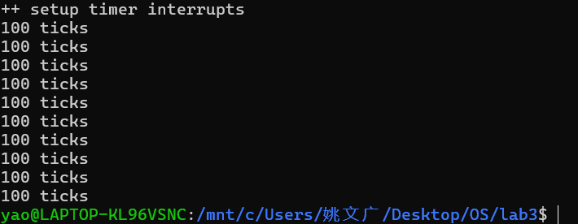
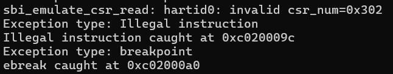
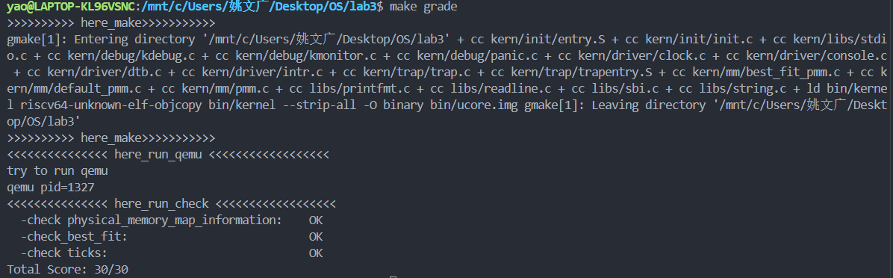

# 中断与中断处理流程

小组成员：陈忠镇  姚文广  田子煊


## 实验目的

操作系统是计算机系统的监管者，必须能对计算机系统状态的突发变化做出反应，这些系统状态可能是程序执行出现异常，或者是突发的外设请求。当计算机系统遇到突发情况时，不得不停止当前的正常工作，应急响应一下，这是需要操作系统来接管，并跳转到对应处理函数进行处理，处理结束后再回到原来的地方继续执行指令。这个过程就是中断处理过程。

- RISC-V 的中断相关知识
- 中断前后如何进行上下文环境的保存与恢复
- 处理最简单的断点中断和时钟中断


## 实验过程

### 练习1：完善中断处理 （需要编程）

>请编程完善trap.c中的中断处理函数trap，在对时钟中断进行处理的部分填写kern/trap/trap.c函数中处理时钟中断的部分，使操作系统每遇到100次时钟中断后，调用print_ticks子程序，向屏幕上打印一行文字”100 ticks”，在打印完10行后调用sbi.h中的shut_down()函数关机。

> 要求完成问题1提出的相关函数实现，提交改进后的源代码包（可以编译执行），并在实验报告中简要说明实现过程和定时器中断中断处理的流程。实现要求的部分代码后，运行整个系统，大约每1秒会输出一次”100 ticks”，输出10行。

##### 实现代码：

```c
clock_set_next_event();
ticks++;

if (ticks % TICK_NUM == 0) {
    print_ticks();
    num++;
    if (num == 10) {
        sbi_shutdown();
    }
}
break;
```

#### 时钟中断处理实现

  ● **设置下次时钟中断**：首先调用 `clock_set_next_event()` 函数，设置下一次的时钟中断时间。

  ● **计数器递增**：每次发生时钟中断时，`ticks` 计数器自增1。

  ● **周期性输出**：当 `ticks` 计数达到 100 的倍数时（即 `ticks % TICK_NUM == 0`）：

  -  调用 `print_ticks()` 函数输出 "100 ticks" 信息
  - `num` 计数器自增1，记录输出次数

  ● **系统关机**：当输出次数 `num` 达到 10 次时，调用 `sbi_shutdown()` 函数实现系统关机。

#### 定时器中断处理流程

​    ● **中断触发**：当发生时钟中断时，CPU 会跳转到寄存器 `stvec` 中保存的地址执行指令，即 `__alltraps` 标号位置。

​    ● **上下文保存**：在 `__alltraps` 处保存所有寄存器的状态，建立中断上下文。

​    ● **参数传递**：执行 `mov a0, sp` 指令，将栈指针 `sp` 的值保存到寄存器 `a0` 中，作为后续函数的参数。

​    ● **中断分发**：跳转到 `trap()` 函数继续执行，该函数会调用 `trap_dispatch()` 进行中断类型判断。

​    ● **中断类型判断**：在 `trap_dispatch()` 中判断异常类型为中断后，跳转到中断处理函数 `interrupt_handler()`。

​    ● **具体中断处理**：根据 `cause` 寄存器的值，识别到是定时器中断后，跳转到 `IRQ_S_TIMER` 标号处执行具体的时钟中断处理代码。




### Challenge1：描述与理解中断流程

> 回答：描述ucore中处理中断异常的流程（从异常的产生开始），其中mov a0，sp的目的是什么？SAVE_ALL中寄寄存器保存在栈中的位置是什么确定的？对于任何中断，__alltraps 中都需要保存所有寄存器吗？请说明理由.

1、**异常处理的步骤如下：**

   1.1 异常产生后，会跳转到寄存器 `stvec` 保存的地址执行指令，由于内核初始化时将该寄存器设置为 `__alltraps`，所以会跳转到 `trapentry.S` 中的 `__alltraps` 标签处执行。

   1.2 在 `__alltraps` 中首先保存所有寄存器的状态，然后执行 `mov a0, sp` 将栈指针保存到 `a0` 寄存器中，之后跳转到 `trap` 函数继续执行。

   1.3 在 `trap` 函数中调用 `trap_dispatch` 函数，判断异常类型是中断还是异常，分别跳转到对应的处理函数 `interrupt_handler` 或 `exception_handler`，根据 `cause` 寄存器的值执行相应的处理程序。

2、**执行 `mov a0, sp` 的原因是：**根据 RISC-V 的函数调用规范，`a0`-`a7` 寄存器用于存储函数参数，而 `trap` 函数只有一个参数，是指向 `trapframe` 结构体的指针，通过 `mov a0, sp` 将当前栈指针（指向保存的寄存器状态）传递给 `trap` 函数，使得处理函数能够访问完整的中断上下文信息。

3、**寄存器保存在栈中的位置**是由结构体 `trapframe` 和 `pushregs` 的定义顺序决定的，通过 `sp` 指针在栈中开辟 36 个寄存器的空间，每个寄存器按照预定义的偏移量顺序存储，例如 `x0` 寄存器保存在 `0*REGBYTES(sp)` 位置，`s0` 寄存器保存在 `2*REGBYTES(sp)` 位置，这种固定的布局确保了后续 `trap` 函数能够正确访问这些保存的寄存器值。

4、对于任何中断，**`__alltraps` 中都需要保存所有寄存器**，因为这些寄存器都将作为 `trap` 函数参数的重要组成部分，如果不完整保存就会导致函数参数缺失，无法正确恢复中断前的执行环境；虽然**从理论上分析某些中断可能只需要保存部分寄存器**，但 ucore 采用统一的设计来确保系统的可靠性，如果未来修改 `trap` 参数结构体的定义，可以考虑优化保存的寄存器集合，例如不需要保存恒为 0 的 `x0` 寄存器。


### Challenge2：理解上下文切换机制

> 回答：在trapentry.S中汇编代码 csrw sscratch, sp；csrrw s0, sscratch, x0实现了什么操作，目的是什么？save all里面保存了stval scause这些csr，而在restore all里面却不还原它们？那这样store的意义何在呢？

1、**`csrw sscratch, sp` 与 `csrrw s0, sscratch, x0` 的操作及目的如下：**

1.1 `csrw sscratch, sp` 的操作与目的：
- 操作：将陷阱发生时的栈指针（sp，即 x2 寄存器）值，写入 `sscratch` 寄存器（Supervisor Scratch 寄存器，用于临时存储）。
- 目的：陷阱处理下一步需通过 `addi sp, sp, -36 * REGBYTES` 调整栈指针，为保存寄存器分配空间，因此需先将**进入陷阱前的原始 sp** 暂存到 `sscratch` 这个安全的临时 CSR 中。

1.2 `csrrw s0, sscratch, x0` 的操作与目的：
- 操作：`csrrw` 是原子交换指令，一方面将 `sscratch` 中暂存的原始 sp 读取到 s0 寄存器，另一方面将 x0（值恒为 0）写入 `sscratch` 寄存器。
- 目的：一是通过 s0 拿到原始 sp，后续通过 `STORE s0, 2*REGBYTES(sp)` 将其保存到栈上，完成对 x2 寄存器的保存；二是将 `sscratch` 设为 0，作为**“当前处于陷阱处理上下文”的标记**，若后续发生递归陷阱，入口代码可通过检查 `sscratch` 是否为 0 判断上下文，避免重复调整栈或覆盖数据。


2、**SAVE_ALL 保存 stval/scause 等 CSR，RESTORE_ALL 不全部还原的原因如下：**

2.1 SAVE_ALL 保存这些 CSR 的意义：
SAVE_ALL 中保存的 `sstatus`（处理器状态）、`sepc`（陷阱前 PC）、`sbadaddr`（即 stval，错误地址）、`scause`（陷阱原因）均为**陷阱发生时的关键上下文信息**，必须保存到栈上供后续 `trap` 函数访问——`scause` 用于判断陷阱类型（中断/异常），`sbadaddr` 用于定位内存访问错误地址，`sepc` 是陷阱返回的目标地址，`sstatus` 记录陷阱前的处理器状态（如中断使能），这些信息是 `trap` 函数处理陷阱的核心依据。

2.2 RESTORE_ALL 仅还原部分 CSR 的原因：
- 需还原的 CSR（`sstatus`、`sepc`）：`sepc` 是 `sret` 指令返回陷阱前执行流的关键（依赖其指向的 PC），`sstatus` 记录陷阱前的处理器状态（如中断开关），若不还原会导致程序恢复执行后状态异常，因此必须恢复。
- 不还原的 CSR（`sbadaddr`、`scause`）：这两个寄存器的值仅对**当前陷阱**有效，下次发生新陷阱时，硬件会自动覆盖其值（写入新的错误地址/陷阱原因）。若在 RESTORE_ALL 中还原，会保留旧陷阱信息，干扰下一次陷阱处理，因此无需还原，保存的意义仅为本次 `trap` 函数使用。


### Challenge3：完善异常中断

> 编程完善在触发一条非法指令异常和断点异常，在 kern/trap/trap.c的异常处理函数中捕获，并对其进行处理，简单输出异常类型和异常指令触发地址，即“Illegal instruction caught at 0x(地址)”，“ebreak caught at 0x（地址）”与“Exception type:Illegal instruction"，“Exception type: breakpoint”。

实现代码：

```
 case CAUSE_ILLEGAL_INSTRUCTION:
      // 非法指令异常处理
      /* LAB3 CHALLENGE3   YOUR CODE :  */
     /*(1)输出指令异常类型（ Illegal instruction）
      *(2)输出异常指令地址
      *(3)更新 tf->epc寄存器
     */
     cprintf("Exception type: Illegal instruction\n");
     cprintf("Illegal instruction caught at 0x%08x\n", tf->epc);
     tf->epc += 4;  // 跳过当前非法指令，继续执行下一条指令
     break;
 case CAUSE_BREAKPOINT:
     //断点异常处理
     /* LAB3 CHALLLENGE3   YOUR CODE :  */
     /*(1)输出指令异常类型（ breakpoint）
      *(2)输出异常指令地址
      *(3)更新 tf->epc寄存器
     */
     cprintf("Exception type: breakpoint\n");
     cprintf("ebreak caught at 0x%08x\n", tf->epc);
     tf->epc += 2;  // 跳过断点指令，继续执行下一条指令
     break;
```

运行输出如下：

```
sbi emulate csr read:hartid0:invalid csr_num=0x302
Exception type:Illegal instruction
Illegal instruction caught at 0xc020009c
Exception type:breakpoint
ebreak caught at xc02000a0
```



异常处理必须在调用 `idt_init()` 之后才能正确执行，因为该函数负责设置 `stvec` 寄存器的值；在此之前，系统无法跳转至我们定义的异常处理程序。


### 附

#### 一、make grade运行图



#### 二、do...while(0) 在宏定义中的作用

在kern/sync/sync.h这个头文件中，local_intr_save宏定义里使用do { ... } while(0)，经过查询后得知这是C语言里一个非常经典的编程技巧，主要是为了让宏的行为更像一个真正的函数或单条语句，避免在一些特殊情况下出现意想不到的编译错误。

其实可以反着看，假如这个宏不用do...while(0)来包裹，会发生什么。最常见的问题出现在if-else语句中，比如使用下面这样的代码：

```
if (some_condition)
    local_intr_save(x); // 习惯性地加上了分号
else
    // do something else
```

如果local_intr_save(x)这个宏仅仅是用花括号{}包起来的，那么它展开后就会变成：

```
if (some_condition)
    { x = __intr_save(); }; // 注意这个分号！
else
    // do something else
```

问题就出在那个分号上。编译器会认为if语句在花括号后面的分号那里就已经结束了，这个分号成了一条独立的空语句。这样一来，后面的else就找不到与之配对的if，从而导致编译失败。

而do { ... } while(0)结构就巧妙地解决了这个问题。它把宏内部的代码变成了一个循环体，这个循环体本身就是C语法里的一条完整语句，并且它“吃掉”了跟在宏调用后面的那个分号，使之成为自身语法的一部分。当宏展开后，代码就变成了：

```
if (some_condition)
    do { x = __intr_save(); } while(0); // 整个 do-while 是一条语句
else
    // do something else```
```

这样一来，整个`do...while(0);`被编译器视为一条完整的、单一的语句，`if-else`的结构就保持了完整性，代码的逻辑也就正确了。

所以这里使用`do...while(0)`并不是为了实现循环，而是为宏定义穿上了一层“安全外衣”，确保它在任何代码结构中都能被正确地、无歧义地解析，让宏用起来更安全、更健壮。
