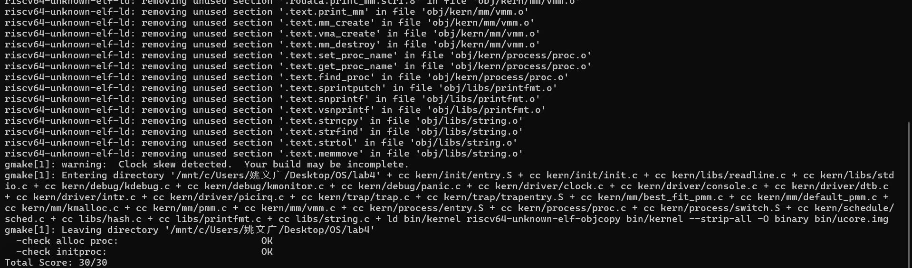

# 进程管理

小组成员：陈忠镇  姚文广  田子煊


## 实验目的

- 了解虚拟内存管理的基本结构，掌握虚拟内存的组织与管理方式
- 了解内核线程创建/执行的管理过程
- 了解内核线程的切换和基本调度过程


## 实验过程

### 练习1：分配并初始化一个进程控制块（需要编码）

>alloc_proc函数（位于kern/process/proc.c中）负责分配并返回一个新的struct proc_struct结构，用于存储新建立的内核线程的管理信息。ucore需要对这个结构进行最基本的初始化，你需要完成这个初始化过程。
>
>请在实验报告中简要说明你的设计实现过程。请回答如下问题：
>
>- 请说明proc_struct中`struct context context`和`struct trapframe *tf`成员变量含义和在本实验中的作用是啥？（提示通过看代码和编程调试可以判断出来）

##### 设计代码：

我们可以首先观察原始代码，信息如下所示：

```c
static struct proc_struct *
alloc_proc(void)
{
    struct proc_struct *proc = kmalloc(sizeof(struct proc_struct));
    if (proc != NULL)
    {
          enum proc_state state;                      // Process state
          int pid;                                    // Process ID
          int runs;                                   // the running times of Proces
          uintptr_t kstack;                           // Process kernel stack
          volatile bool need_resched;                 // bool value: need to be rescheduled to release CPU?
          struct proc_struct *parent;                 // the parent process
          struct mm_struct *mm;                       // Process's memory management field
          struct context context;                     // Switch here to run process
          struct trapframe *tf;                       // Trap frame for current interrupt
          uintptr_t pgdir;                            // the base addr of Page Directroy Table(PDT)
          uint32_t flags;                             // Process flag
          char name[PROC_NAME_LEN + 1];               // Process name
    }
    return proc;
}
```

根据指导书上的提示，我们需要做的就是将这些变量进行初始化即可。设置进程为"初始"态，我们需要使用`PROC_UNINIT`；设置进程pid的未初始化值，我们需要使用`-1`；使用内核页目录表的基址，我们需要使用`boot_pgdir_pa`。

在原始代码中，我们只是声明了`proc_struct`结构体的各个成员变量，但没有进行实际的初始化赋值。在修改后的代码中，我们为每个关键字段赋予了合理的初始值：

**具体的初始化操作如下：**

- `proc->state = PROC_UNINIT;`  
  将进程状态设置为未初始化状态，这是进程生命周期的起始状态

- `proc->pid = -1;`  
  将进程ID设置为-1，表示该进程尚未分配有效的进程标识符

- `proc->runs = 0;`  
  将进程运行次数初始化为0，记录进程被调度执行的次数

- `proc->pgdir = boot_pgdir_pa;`  
  设置页目录基址为内核页目录表的物理地址，这是进程内存管理的基础

- `proc->kstack = 0;`  
  将内核栈指针初始化为0，表示尚未分配内核栈空间

- `proc->need_resched = 0;`  
  将调度标志初始化为0，表示当前不需要重新调度

- `proc->parent = NULL;`  
  将父进程指针设置为NULL，表示初始时没有父进程

- `proc->mm = NULL;`  
  将内存管理结构指针设置为NULL，表示尚未建立进程专属的内存空间

- `proc->tf = NULL;`  
  将陷阱帧指针设置为NULL，用于中断处理时保存上下文

- `proc->flags = 0;`  
  将进程标志初始化为0，清除所有特殊标志位

- `memset(&proc->name, 0, PROC_NAME_LEN);`  
  使用memset清空进程名称缓冲区，确保名称字段为全零

- `memset(&proc->context, 0, sizeof(struct context));`  
  使用memset清空进程上下文结构，为进程切换做好准备

```c
static struct proc_struct *
alloc_proc(void)
{
    struct proc_struct *proc = kmalloc(sizeof(struct proc_struct));
    if (proc != NULL)
    {
        proc->state=PROC_UNINIT;
        proc->pid=-1;
        proc->runs=0;
        proc->pgdir = boot_pgdir_pa;
        proc->kstack=0;
        proc->need_resched=0;
        proc->parent = NULL;
        proc->mm = NULL;
        proc->tf=NULL;
        proc->flags = 0;
        memset(&proc->name, 0, PROC_NAME_LEN);
        memset(&proc->context,0,sizeof(struct context));
    }
    return proc;
}
```

这样确保了新分配的进程结构体具有确定的初始状态，为后续的进程管理操作奠定了基础。

#### 问题回答：

**struct** **context** **context** 

struct context context 用于保存进程在内核中执行时的上下文（Context）。这个上下文中包含了当一个进程被调度器换出时，为了在未来能够被顺利换回并继续执行所必须保存的关键寄存器。它的核心作用是**实现进程的调度与切换**。

当调度器决定从当前进程（prev）切换到下一个进程（next）时，会调用一个核心的切换函数 switch_to。这个函数负责：

1. 保存 prev 进程的 context。
2. 加载 next 进程的 context。
3. 跳转到 next 进程的执行流中。

context 的结构体定义如下，它主要包含RISC-V架构下的被调用者保存寄存器（callee-saved registers）。

```c
struct context {
    uintptr_t ra;    // Return Address (返回地址寄存器)
    uintptr_t sp;    // Stack Pointer (栈指针寄存器)
    
    // Callee-saved registers (被调用者保存寄存器)
    uintptr_t s0;
    uintptr_t s1;
    uintptr_t s2;
    uintptr_t s3;
    uintptr_t s4;
    uintptr_t s5;
    uintptr_t s6;
    uintptr_t s7;
    uintptr_t s8;
    uintptr_t s9;
    uintptr_t s10;
    uintptr_t s11;
};
```

- ra：返回地址寄存器。在 switch_to 的实现中，ra 指向了 switch_to 调用结束后的返回点，确保切换回来后能从正确的位置继续执行。
- sp：栈指针寄存器。指向当前进程的内核栈顶，保存和恢复 sp 意味着切换了内核栈。
- s0 - s11：被调用者保存寄存器。这些寄存器按照RISC-V的ABI（应用二进制接口）规定，在函数调用中其值必须由被调用函数来保护。

所以为什么 context 不保存所有的通用寄存器？

是因为进程切换函数 switch_to 本身也是一个函数调用。根据RISC-V的ABI，寄存器分为**调用者保存（caller-saved）**和**被调用者保存（callee-saved）**两种。

- **调用者保存寄存器**（如 a0-a7, t0-t6）：如果调用者函数希望在调用另一个函数后继续使用这些寄存器中的值，它自己负责在调用前将它们压栈保存。
- **被调用者保存寄存器**（如 s0-s11）：被调用的函数必须保证在返回时，这些寄存器的值与它被调用时相同。如果被调用函数需要使用它们，必须自己先将它们压栈，在返回前再恢复。

由于 switch_to 是在调度函数（如 proc_run）中被调用的，编译器会自动生成代码来保存调用者保存寄存器。因此，switch_to 的任务**只需要保存和恢复被调用者保存寄存器**即可，这大大简化了上下文切换的实现。

**struct** **trapframe** ***tf**

struct trapframe *tf 指向一个**中断帧（Trap Frame）**，它完整地保存了进程在**用户态**执行时的所有状态。当一个用户态进程因为以下原因进入内核态时，CPU的硬件或内核的底层代码会立即创建一个中断帧：

1. **系统调用（System Call）**：用户程序主动请求内核服务。
2. **异常（Exception）**：如缺页、非法指令等。
3. **外部中断（Interrupt）**：如时钟中断、I/O中断。

中断帧的作用是**保存用户态的现场**，以便内核处理完相应事务后，能够精确无误地恢复到用户态的断点继续执行，对用户程序来说，这个过程是透明的。中断帧需要保存所有通用寄存器以及一些与中断相关的控制状态寄存器（CSRs）。

```c++
// 32个通用寄存器
struct pushregs {
    uintptr_t zero;  // Hard-wired zero
    uintptr_t ra;    // Return address
    uintptr_t sp;    // Stack pointer
    uintptr_t gp;    // Global pointer
    uintptr_t tp;    // Thread pointer
    uintptr_t t0, t1, t2; // Temporaries
    uintptr_t s0, s1;     // Saved register/frame pointer
    uintptr_t a0, a1, a2, a3, a4, a5, a6, a7; // Function arguments/return values
    uintptr_t s2, s3, s4, s5, s6, s7, s8, s9, s10, s11; // Saved registers
    uintptr_t t3, t4, t5, t6; // Temporaries
};

// 完整的中断帧
struct trapframe {
    struct pushregs gpr; // 通用寄存器组
    uintptr_t status;    // 状态寄存器 (SSTATUS)，包含中断使能等信息
    uintptr_t epc;       // 异常程序计数器 (SEPC)，保存发生中断时的指令地址
    uintptr_t badvaddr;  // 错误地址寄存器 (SBADADDR)，保存引发异常的内存地址
    uintptr_t cause;     // 中断原因寄存器 (SCAUSE)，保存异常或中断的类型
};
```

trapframe 在实验中扮演着至关重要的角色，尤其体现在以下两方面：

1. **处理系统调用返回值**：当用户进程发起系统调用（如 fork）后，内核完成相应操作。在返回用户态之前，内核可以通过修改 trapframe 的内容来影响用户进程的返回值。例如，在 fork 系统调用中，对于子进程，内核会将其 trapframe 中的 a0 寄存器（函数返回值寄存器）设置为0。

   ```c++
   // 伪代码: fork() 的内核实现
   struct proc_struct *child_proc = ...;
   // ... 复制父进程的 trapframe 到子进程
   child_proc->tf->gpr.a0 = 0; // 设置子进程的返回值为 0
   ```

2. **创建新进程/线程的初始状态**：当创建一个全新的进程或内核线程准备首次进入用户态执行时，它还没有一个有效的用户态上下文。此时，内核需要为其**伪造（Forge）**一个 trapframe。通过精心设置 trapframe 的内容，可以精确控制新进程从何处开始执行。

   - 设置 tf->epc 为用户程序的入口地址。
   - 设置 tf->sp 为用户栈的栈顶地址。
   - 在创建内核线程执行特定函数时，可以通过 s0 和 s1 等寄存器来传递函数指针和参数。


### 练习2：为新创建的内核线程分配资源（需要编码）

> 创建一个内核线程需要分配和设置好很多资源。kernel_thread函数通过调用**do_fork**函数完成具体内核线程的创建工作。do_kernel函数会调用alloc_proc函数来分配并初始化一个进程控制块，但alloc_proc只是找到了一小块内存用以记录进程的必要信息，并没有实际分配这些资源。ucore一般通过do_fork实际创建新的内核线程。do_fork的作用是，创建当前内核线程的一个副本，它们的执行上下文、代码、数据都一样，但是存储位置不同。因此，我们**实际需要"fork"的东西就是stack和trapframe**。在这个过程中，需要给新内核线程分配资源，并且复制原进程的状态。你需要完成在kern/process/proc.c中的do_fork函数中的处理过程。它的大致执行步骤包括：
>
> - 调用alloc_proc，首先获得一块用户信息块。
> - 为进程分配一个内核栈。
> - 复制原进程的内存管理信息到新进程（但内核线程不必做此事）
> - 复制原进程上下文到新进程
> - 将新进程添加到进程列表
> - 唤醒新进程
> - 返回新进程号
>
> 请在实验报告中简要说明你的设计实现过程。请回答如下问题：
>
> - 请说明ucore是否做到给每个新fork的线程一个唯一的id？请说明你的分析和理由。

do_fork 函数通过一系列步骤创建了一个新的内核线程。这些步骤包括分配进程控制块（PCB）、分配内核栈、加入进程列表等。根据实验提示可以进行以下的编程，确保新线程的所有资源都被正确初始化并纳入内核管理。

**代码设计**

为新线程获取一个 proc_struct 结构体，如果失败则直接退出。

```c++
if ((proc = alloc_proc()) == NULL) {
    goto fork_out;
}
```

为新线程分配独立的内核栈空间。

```C+
if (setup_kstack(proc) != 0) {
    goto bad_fork_cleanup_proc;
}
```

处理地址空间。对于内核线程，此步骤仅为占位，不涉及实际的内存复制。

```C++
if (copy_mm(clone_flags, proc) != 0) {
    goto bad_fork_cleanup_kstack;
}
```

调用 copy_thread 函数，这是整个创建过程中最关键的一环。它为新线程“伪造”了启动所需的上下文（context）和中断帧（trapframe），决定了线程的“第一声啼哭”从何处响起。

```c++
copy_thread(proc, stack, tf);
//此函数内部会：
1.  复制 父进程的中断帧 `tf` 到子进程的内核栈顶。
2.  修改 子进程中断帧中的 `a0` 寄存器（返回值）为 `0`。
3.  设置 子进程的 `context.ra`（返回地址）指向 `forkret` 函数，使其成为新线程被调度后的第一个执行点。
4.  链接 `context.sp`（栈指针）指向中断帧，为 `forkret` 后的执行做好准备。
为新线程分配一个唯一的PID，并将其添加到内核的全局进程哈希表和链表中，以便被调度器发现。

proc->pid = get_pid();
hash_proc(proc);
list_add(&proc_list, &(proc->list_link));
```

将新线程的状态设置为 PROC_RUNNABLE，使其成为可被调度的候选者。

```c++
wakeup_proc(proc);
为父进程设置返回值为新创建子线程的PID。

ret = proc->pid;
```

通过上面的流程，代码完整地实现了新内核线程的创建。从分配资源到设置关键的初始执行状态，再到最终纳入调度体系，每一步都清晰且必要，最终成功地实现一个可运行的新线程。

#### 问题回答：

**是的，ucore 通过 get_pid 函数，能够确保为每个新线程分配一个唯一的 ID。**这个函数采用了一种**带有“安全区间”优化的循环查找策略**来实现这一目标。它不仅保证了 PID 的唯一性，还在大多数情况下提供了非常高的分配效率。我们可以从代码入手来进行分析。

```
static int
get_pid(void) {
    // 静态断言，确保PID的最大值大于进程的最大数量，这是实现分配的基础
    static_assert(MAX_PID > MAX_PROCESS);
    struct proc_struct *proc;
    list_entry_t *list = &proc_list, *le;
    // 关键的静态变量，用于在多次函数调用间保持状态
    static int next_safe = MAX_PID, last_pid = MAX_PID;

    // 尝试分配下一个PID
    if (++last_pid >= MAX_PID) {
        last_pid = 1;
        goto inside;
    }

    // 核心优化：检查last_pid是否仍在安全区间内
    if (last_pid >= next_safe) {
    inside:
        // 安全区间失效，需要遍历链表重新计算
        next_safe = MAX_PID;
    repeat:
        le = list;
        while ((le = list_next(le)) != list) {
            proc = le2proc(le, list_link);
            if (proc->pid == last_pid) {
                // 发现冲突，last_pid自增后重新扫描
                if (++last_pid >= next_safe) {
                    if (last_pid >= MAX_PID) {
                        last_pid = 1;
                    }
                    next_safe = MAX_PID;
                    goto repeat;
                }
            }
            // 在扫描过程中，更新next_safe
            else if (proc->pid > last_pid && next_safe > proc->pid) {
                next_safe = proc->pid;
            }
        }
    }
    // last_pid有效，返回
    return last_pid;
}
```

get_pid 的核心思想是：**尽可能快地找到一个未被使用的 PID**。它通过两个静态变量 last_pid 和 next_safe 来优化这个过程。

1. **关键变量定义**

   - static int last_pid: 记录上一次成功分配出去的 PID。函数再次被调用时，会从 last_pid + 1 开始尝试。
   - static int next_safe: 记录一个“下一个安全的 PID”。它的精确含义是：在所有已分配的 PID 中，**大于 last_pid 的那个最小的 PID**。

2. **“安全区间”优化机制**
   这两个变量构成了一个隐含的“安全区间”：[last_pid + 1, next_safe - 1]。任何落在这个区间内的 PID 都可以被认为是**绝对安全、未经使用**的，因此可以直接分配，无需遍历进程列表检查。这使得 PID 的分配在大多数情况下是一个 O(1) 操作。

3. **两种执行路径**

   - **快速路径 (Fast Path):**
     这是最常见的情况。函数首先将 last_pid 加一。然后，通过 if (last_pid < next_safe) 判断（代码中是 if (last_pid >= next_safe) 的反面），发现新的 last_pid 仍然小于 next_safe。这意味着新的 PID 位于安全的分配区间内，函数可以直接返回 last_pid。
   - **慢速路径 (Slow Path):**
     当 last_pid 耗尽了安全区间（即 last_pid >= next_safe），或者 last_pid 到达 MAX_PID 而回滚到 1 时，优化失效。此时，函数必须进入 inside 和 repeat 标签后的慢速路径：
     1. **遍历进程列表 (proc_list)**: 对当前所有存在的进程进行一次完整的扫描。
     2. **解决冲突**: 在遍历时，检查当前尝试的 last_pid 是否已经被某个进程占用。如果被占用，就将 last_pid 加一，并从头 (goto repeat) 再次进行整个列表的扫描。
     3. **重建“安全区间”**: 在扫描过程中，同时寻找大于当前 last_pid 的最小已分配 PID，并用它来更新 next_safe。

   通过这个过程，函数不仅为**当前**的请求找到了一个可用的 PID，更重要的是，它为**未来**的请求重建了一个新的“安全区间”，使得下一次（或几次）的 get_pid 调用又能回到高效的快速路径上。

所以可以看出：

- **唯一性保证**：无论是快速路径还是慢速路径，get_pid 的核心逻辑都保证了返回的 last_pid 在当前时刻是未被任何现存进程使用的。慢速路径中的全局扫描和冲突解决机制是保证唯一性的最后防线。
- **效率**：相比于每次都暴力遍历所有进程来查找可用 PID 的简单算法，get_pid 通过维护 next_safe 这个“安全区间”的上限，极大地提升了分配效率。只有在无法延续快速分配时，才付出全局扫描的代价。


### 练习3：编写proc_run 函数（需要编码）

> proc_run用于将指定的进程切换到CPU上运行。它的大致执行步骤包括：
>
> - 检查要切换的进程是否与当前正在运行的进程相同，如果相同则不需要切换。
> - 禁用中断。你可以使用`/kern/sync/sync.h`中定义好的宏`local_intr_save(x)`和`local_intr_restore(x)`来实现关、开中断。
> - 切换当前进程为要运行的进程。
> - 切换页表，以便使用新进程的地址空间。`/libs/riscv.h`中提供了`lsatp(unsigned int pgdir)`函数，可实现修改SATP寄存器值的功能。
> - 实现上下文切换。`/kern/process`中已经预先编写好了`switch.S`，其中定义了`switch_to()`函数。可实现两个进程的context切换。
> - 允许中断。
>
> 请回答如下问题：
>
> - 在本实验的执行过程中，创建且运行了几个内核线程？
>
> 完成代码编写后，编译并运行代码：make qemu

**设计代码**：

```c++
void proc_run(struct proc_struct *proc)
{
    if (proc != current)
    {
        bool intr_flag;
        local_intr_save(intr_flag);
        {
            struct proc_struct *curr_proc = current;
            current = proc;
            switch_to(&(curr_proc->context),&(proc->context));
        }
        local_intr_restore(intr_flag);
    }
}
```

##### **proc_run 函数中各个步骤的具体操作：**

1. **检查进程是否需要切换**：

   ```c
   if (proc != current)
   ```

2. 首先判断即将要运行的进程 proc 是否就是当前正在运行的进程 current。如果两者相同，则无需执行任何切换操作，函数直接返回，避免了不必要的开销。

3. **保存中断状态并禁用中断**：

   ```c
   bool intr_flag;
   local_intr_save(intr_flag);
   ```

   在进入进程切换这个核心的临界区之前，必须禁用中断。这是为了保证切换过程的**原子性**，防止在切换过程中（例如，在 current 指针已经更新但上下文还未切换时）被一个时钟中断打断，从而导致系统状态不一致。local_intr_save 宏会将当前的中断状态保存到 intr_flag 变量中，然后禁用中断。

   ```c
   #define local_intr_save(x) \
       do {                   \
           x = __intr_save(); \
       } while (0)
   ```

4. **更新当前进程指针**：

   ```c
   struct proc_struct *curr_proc = current;
   current = proc;
   ```

   首先，使用一个临时指针 curr_proc 保存当前进程的控制块。随后，将全局的 current 指针更新为即将要运行的新进程 proc。从这一刻起，从操作系统的视角来看，当前运行的进程已经改变了。

5. **执行上下文切换**：

   ```c
   switch_to(&(curr_proc->context), &(proc->context));
   ```

   这是整个进程切换的核心。switch_to 是一个用汇编实现的底层函数，它执行以下两个关键操作：

   - **保存旧进程的上下文**：将当前 CPU 的寄存器（如 ra, sp, s0-s11 等被调用者保存寄存器）保存到 curr_proc->context 结构体中。
   - **加载新进程的上下文**：从 proc->context 结构体中取出之前保存的寄存器值，并加载到 CPU 的相应寄存器中。
     当 switch_to 函数返回时，CPU 的指令指针（PC）已经指向了新进程上次被中断时的位置，执行流从而被彻底改变。

6. **恢复中断状态**：
   local_intr_restore(intr_flag);
   上下文切换完成后，临界区操作结束。此时调用 local_intr_restore 宏，它会根据之前保存在 intr_flag 中的值来恢复中断状态，使得系统可以重新响应外部中断。

   ```c
   #define local_intr_restore(x) __intr_restore(x);
   ```

#### 问题回答：

共创建且运行了两个内核线程`idleproc`和`initproc`。

- **idleproc :**
  作为系统创建的第一个内核线程（PID 0），idleproc 扮演着“哨兵”和“托底”的角色。它本身不执行任何实际任务，其核心职责是在系统中没有其他任何就绪进程可运行时，占用 CPU 以防止系统停机。它会不断地调用调度器，是系统多任务调度的起点，也是CPU在无事可做时的最终归宿。
- **initproc :**
  作为系统创建的第二个内核线程（PID 1），initproc 是第一个执行**具体任务**的进程。在本次实验中，它负责执行内核的主函数（如 init_main），用于完成后续的系统初始化、创建其他用户进程、或执行实验指定的测试功能。在更完整的操作系统中，initproc 最终会演变成所有用户进程的始祖，是整个用户态世界的起点。

**idleproc 的创建步骤：**

1. **分配PCB**：调用 alloc_proc() 为空闲进程分配一个进程控制块。
2. **设置属性**：设置该进程的 PID 为 0，状态为 PROC_RUNNABLE。
3. **更新计数**：增加全局进程总数。
4. **设为当前**：将全局 current 指针指向 idleproc，使其成为系统启动后的第一个运行进程。

**initproc 的创建步骤：**

1. **创建线程**：调用 kernel_thread() 创建一个新内核线程，其任务是执行 init_main 函数。
2. **获取PID**：kernel_thread() 会为新线程分配一个 PID（通常是1）并返回。
3. **查找PCB**：根据返回的 PID，调用 find_proc() 找到该线程的进程控制块。
4. **命名进程**：将该进程的名称设置为 "initproc"，以便识别。
5. **验证**：通过断言（assert）确保 initproc 进程已成功创建并存在于进程列表中。

**运行 idleproc**：
  在 proc_init 初始化结束时，系统将 current 设置为 idleproc，并立即将其 need_resched 标志置为 1。这会强制系统在进入主循环后立刻触发一次调度。
**运行 initproc**：
  CPU 进入 cpu_idle 函数后，检查到 idleproc 的 need_resched 标志为 1，于是调用 schedule()。调度器在进程列表中找到唯一处于就绪态的 initproc，并通过 proc_run 函数将 CPU 的执行上下文从 idleproc 切换到 initproc，initproc 开始执行。

#### make qemu结果图




### 扩展练习Challenge

> 1. 说明语句:
`local_intr_save(intr_flag);
....
local_intr_restore(intr_flag);`
是如何实现开关中断的？
>
> 2. 深入理解不同分页模式的工作原理（思考题）
>
>    get_pte()函数（位于`kern/mm/pmm.c`）用于在页表中查找或创建页表项，从而实现对指定线性地址对应的物理页的访问和映射操作。这在操作系统中的分页机制下，是实现虚拟内存与物理内存之间映射关系非常重要的内容。
>
>    - get_pte()函数中有两段形式类似的代码， 结合sv32，sv39，sv48的异同，解释这两段代码为什么如此相像。
>    - 目前get_pte()函数将页表项的查找和页表项的分配合并在一个函数里，你认为这种写法好吗？有没有必要把两个功能拆开？

#### 1. `local_intr_save(intr_flag); ... local_intr_restore(intr_flag);` 如何实现开关中断？

这组宏通过保存和恢复中断状态实现临界区的中断控制，具体流程如下：

- **`local_intr_save(intr_flag)`**：  
  借助`sync.h`中的`__intr_save`函数实现。该函数首先读取`status`寄存器的`SIE`位（中断使能标志），判断当前中断是否开启：  
  - 若`SIE`位为1（中断开启），则调用`intr_disable()`关闭中断，并将`intr_flag`设为1（记录原状态为开启）。  
  - 若`SIE`位为0（中断已关闭），则直接将`intr_flag`设为0。  
  最终效果是：进入临界区前关闭中断，并保存原中断状态。

- **`local_intr_restore(intr_flag)`**：  
  借助`sync.h`中的`__intr_restore`函数实现。根据`intr_flag`的值恢复中断状态：  
  - 若`intr_flag`为1（原中断开启），则调用`intr_enable()`重新开启中断。  
  - 若`intr_flag`为0（原中断关闭），则保持中断关闭状态。  
  最终效果是：退出临界区时恢复进入前的中断状态，避免影响其他代码的中断行为。


#### 2. 深入理解不同分页模式的工作原理

RISC-V的sv32、sv39、sv48均为分页虚拟内存模式，核心是通过多级页表将虚拟地址映射到物理地址，主要差异在于**虚拟地址位数**和**页表级数**，工作原理共性如下：

1. **虚拟地址拆分**：  
   虚拟地址被拆分为多个“虚拟页号（VPN）”和“页内偏移（offset）”。例如：  
   - sv32（32位虚拟地址）：2级页表，VPN分为VPN[1]（10位）、VPN[0]（10位），偏移12位（4KB页）。  
   - sv39（39位虚拟地址）：3级页表，VPN分为VPN[2]（9位）、VPN[1]（9位）、VPN[0]（9位），偏移12位。  
   - sv48（48位虚拟地址）：4级页表，VPN分为VPN[3]（9位）、VPN[2]（9位）、VPN[1]（9位）、VPN[0]（9位），偏移12位。  

2. **多级页表查找**：  
   从最高级页表开始，每级VPN作为索引查找对应页表项（PTE）：  
   - 若PTE有效（`PTE_V`位为1），则提取下一级页表的物理页号（PPN），继续查找下一级页表。  
   - 最后一级PTE的PPN与页内偏移拼接，得到物理地址。  

3. **页表项（PTE）功能**：  
   每个PTE包含有效位（`PTE_V`）、权限位（`PTE_U`/`PTE_R`/`PTE_W`等）、下一级页表或物理页的PPN等信息，用于控制访问权限和映射关系。


#### 3. `get_pte()`函数中两段类似代码的原因及功能拆分讨论

#### 两段代码类似的原因  
`get_pte()`的两段代码分别处理**不同级别的页表索引**（如sv39的两级页表索引，或更高层级的中间级索引），由于多级页表的**查找逻辑一致**，因此代码形式相似：  

- 第一段处理第一级页表索引（如`PDX1(la)`）：检查当前级页表项是否有效，若无效且需要创建（`create=1`），则分配一页作为下一级页表，并初始化该页表项。  
- 第二段处理第二级页表索引（如`PDX0(la)`）：逻辑与第一段完全一致，目的是继续查找下一级页表，直到最终找到或创建目标PTE。  

这种相似性源于多级页表的**递归结构**：每一级页表的作用都是通过VPN索引定位下一级页表或物理页，因此处理逻辑复用，代码形式自然相似。


##### 功能是否需要拆分  
当前`get_pte()`将“查找页表项”和“创建页表项（分配新页表）”合并，利弊如下：  

- **优点**：接口简洁，一次调用即可完成“查找+按需创建”，适合分页初始化等场景（如`boot_map_segment`需要自动创建缺失的页表）。  
- **缺点**：功能耦合，当仅需查找（`create=0`）时，代码中仍需携带创建相关的条件判断，可读性和可维护性稍差。  

**建议拆分**：将“纯查找”和“创建”拆分为两个函数（如`find_pte()`和`create_pte()`），再通过`get_pte()`封装两者的组合逻辑。这样既保留接口简洁性，又使单一功能更清晰，便于单独复用（如仅需检查映射是否存在时调用`find_pte()`）。