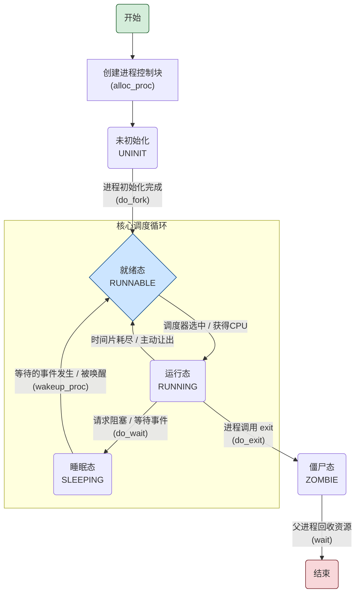
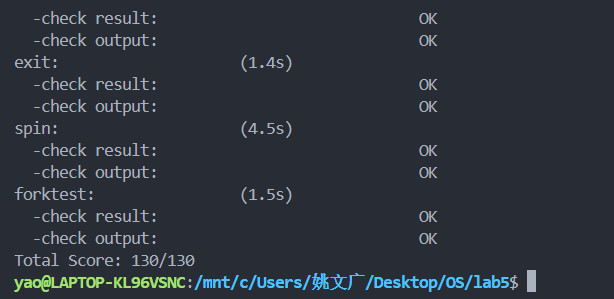

# 用户程序

小组成员：陈忠镇  姚文广  田子煊


## 实验目的

- 了解第一个用户进程创建过程
- 了解系统调用框架的实现机制
- 了解ucore如何实现系统调用sys_fork/sys_exec/sys_exit/sys_wait来进行进程管理


## 实验内容

实验4完成了内核线程，但到目前为止，所有的运行都在内核态执行。实验5将创建用户进程，让用户进程在用户态执行，且在需要ucore支持时，可通过系统调用来让ucore提供服务。为此需要构造出第一个用户进程，并通过系统调用`sys_fork`/`sys_exec`/`sys_exit`/`sys_wait`来支持运行不同的应用程序，完成对用户进程的执行过程的基本管理。


## 实验过程

### 练习0：填写已有实验

> 本实验依赖实验2/3/4。请把你做的实验2/3/4的代码填入本实验中代码中有“LAB2”/“LAB3”/“LAB4”的注释相应部分。注意：为了能够正确执行 `lab5` 的测试应用程序，可能需对已完成的实验2/3/4的代码进行进一步改进。

在Lab4的基础上，为了支持更复杂的进程管理，我们要对进程的创建和初始化流程进行修改。

#### alloc_proc函数

**代码实现**

```c++
static struct proc_struct *
alloc_proc(void) {
    struct proc_struct *proc = kmalloc(sizeof(struct proc_struct));
    if (proc != NULL) {
        proc->state = PROC_UNINIT;
        proc->pid = -1;
        proc->runs = 0;
        proc->kstack = 0;
        proc->need_resched = 0;
        proc->parent = NULL;
        proc->mm = NULL;
        memset(&(proc->context), 0, sizeof(struct context));
        proc->tf = NULL;
        proc->cr3 = boot_cr3;
        proc->flags = 0;
        memset(proc->name, 0, PROC_NAME_LEN);
        proc->wait_state = 0;
        proc->cptr = NULL;
        proc->optr = NULL;
        proc->yptr = NULL;
    }
    return proc;
}
```

**设计说明**

为了支持后续实验中父子进程的等待（wait）与退出（exit）机制，我们对进程控制块（PCB）的初始化函数 alloc_proc 进行了扩展。如代码所示，在原有初始化的基础上，本次修改主要**新增了对进程状态和亲缘关系相关成员的初始化**。具体来说，wait_state被清零，表示新进程不处于任何等待状态；而用于维护进程家族树的 cptr (子进程指针)、optr (兄进程指针) 和 yptr (弟进程指针) 也都被明确地设置为了NULL，确保新分配的进程是一个干净的、无任何关联的独立实体。

#### do_fork函数

**代码实现**

```c++
int
do_fork(uint32_t clone_flags, uintptr_t stack, struct trapframe *tf) {
    int ret = -E_NO_FREE_PROC;
    struct proc_struct *proc;
    if (nr_process >= MAX_PROCESS) {
        goto fork_out;
    }
    ret = -E_NO_MEM;
    if((proc = alloc_proc()) == NULL)
    {
        goto fork_out;
    }
    proc->parent = current; // 添加
    assert(current->wait_state == 0);
    if(setup_kstack(proc) != 0)
    {
        goto bad_fork_cleanup_proc;
    }
    if(copy_mm(clone_flags, proc) != 0)
    {
        goto bad_fork_cleanup_kstack;
    }
    copy_thread(proc, stack, tf);
    bool intr_flag;
    local_intr_save(intr_flag);
    {
        int pid = get_pid();
        proc->pid = pid;
        hash_proc(proc);
        set_links(proc);
    }
    local_intr_restore(intr_flag);
    wakeup_proc(proc);
    ret = proc->pid;
fork_out:
    return ret;
bad_fork_cleanup_kstack:
    put_kstack(proc);
bad_fork_cleanup_proc:
    kfree(proc);
    goto fork_out;
}
```

**设计说明**

在 do_fork 的实现中，我们引入了几个关键的步骤来确保进程关系的正确建立。

1. **建立父子关系**: 通过 proc->parent = current; 这行新增的代码，我们明确了新创建进程（子进程）与当前执行进程（父进程）的亲子关系。
2. **状态断言**: 紧接着的 assert(current->wait_state == 0); 是一个重要的防御性检查。它确保父进程在创建子进程时不处于任何等待状态，这避免了潜在的逻辑冲突和不一致状态。
3. **注册进程关系**: 调用 set_links(proc) 函数是本次修改的另一个核心。该函数负责将新创建的进程正式地加入到全局进程链表，并链接到其父进程的子进程链表中，从而完成其在整个进程家族树中的“注册”流程。

还有就是trap.c修改

```C++
case IRQ_S_TIMER:
        /* LAB5 GRADE   YOUR CODE :  */
        /* 时间片轮转： 
        *(1) 设置下一次时钟中断（clock_set_next_event）
        *(2) ticks 计数器自增
        *(3) 每 TICK_NUM 次中断（如 100 次），进行判断当前是否有进程正在运行，如果有则标记该进程需要被重新调度（current->need_resched）
        */
        // (1) 设置下一次时钟中断
        clock_set_next_event();
        
        // (2) ticks 计数器自增
        ticks++;
        
        // (3) 每 TICK_NUM 次中断，标记需要重新调度
        if (ticks % TICK_NUM == 0) {
            if (current != NULL) {
                current->need_resched = 1;
            }
        }
        break;
```


### 练习1：加载应用程序并执行（需要编码）

> **do_execve**函数调用`load_icode`（位于kern/process/proc.c中）来加载并解析一个处于内存中的ELF执行文件格式的应用程序。你需要补充`load_icode`的第6步，建立相应的用户内存空间来放置应用程序的代码段、数据段等，且要设置好`proc_struct`结构中的成员变量trapframe中的内容，确保在执行此进程后，能够从应用程序设定的起始执行地址开始执行。需设置正确的trapframe内容。
>
> 请在实验报告中简要说明你的设计实现过程。
>
> - 请简要描述这个用户态进程被ucore选择占用CPU执行（RUNNING态）到具体执行应用程序第一条指令的整个经过。

#### 设计实现过程

为了让一个新创建的进程能够正确地从用户态开始执行，操作系统内核必须在加载完程序代码后，精心设置一个“陷阱帧”   （trapframe）。陷阱帧是一个关键的数据结构，它保存了进程在从内核态切换到用户态时需要的所有上下文信息，包括程序计数器（PC）、栈指针（SP）以及处理器的状态寄存器等。当内核执行完加载工作，准备将控制权交给用户程序时，它会通过一条特殊的指令（在RISC-V架构中是sret）恢复陷阱帧里保存的寄存器状态，从而使用户程序得以在正确的地址开始，以正确的权限级别运行。

这个实现过程主要围绕对trapframe结构体中的三个关键成员变量进行设置：

1. **tf->gpr.sp (栈指针)**：设置用户进程的栈指针。
2. **tf->epc (程序计数器)**：设置用户进程的第一条指令地址。
3. **tf->status (状态寄存器)**：配置处理器在用户态下的运行模式。

下面将详细阐述每个部分的实现细节。

```c++
/* LAB5:EXERCISE1 YOUR CODE
     * should set tf->gpr.sp, tf->epc, tf->status
     * NOTICE: If we set trapframe correctly, then the user level process can return to USER MODE from kernel. So
     *          tf->gpr.sp should be user stack top (the value of sp)
     *          tf->epc should be entry point of user program (the value of sepc)
     *          tf->status should be appropriate for user program (the value of sstatus)
     *          hint: check meaning of SPP, SPIE in SSTATUS, use them by SSTATUS_SPP, SSTATUS_SPIE(defined in risv.h)
     */
    tf->gpr.sp = USTACKTOP;  // 设置用户栈顶指针   
    tf->epc = elf->e_entry;  // 设置程序入口点
    tf->status = (sstatus | SSTATUS_SPIE) & ~SSTATUS_SPP; // 设置状态寄存器，允许用户模式运行
```

***1. 设置用户栈指针 (tf->gpr.sp)***

用户进程需要有自己的栈空间来存储函数调用的上下文、局部变量等。按照约定，栈是向下增长的。我们将栈指针 sp 初始化为用户栈空间的最高地址 USTACKTOP。当用户程序开始执行并进行第一次函数调用时，它将从这个地址开始向下分配栈空间。

***2. 设置程序入口点 (tf->epc)***

epc 寄存器在RISC-V架构中用于存放异常或中断返回后需要执行的指令地址。在我们的场景中，当内核通过sret指令从陷阱处理返回时，CPU会跳转到epc所指向的地址。因此，我们需要将epc设置为ELF可执行文件头中定义的程序入口地址elf->e_entry。这样，当进程第一次被调度执行时，它就会从程序的_start处开始运行。

***3. 配置状态寄存器 (tf->status)***

status 寄存器（在RISC-V中为 sstatus）控制着CPU的运行状态，例如中断使能和当前特权级等。为了确保能从内核态正确返回到用户态，需要对sstatus寄存器进行精细的配置。

- **tf->status &= ~SSTATUS_SPP;**
  SSTATUS_SPP (Supervisor Previous Privilege) 位用来指示发生陷阱前的特权级。当SPP为1时，表示陷阱是从Supervisor（内核态）模式发生的；当SPP为0时，表示陷阱是从User（用户态）模式发生的。当执行sret指令返回时，CPU会根据SPP位的值来决定返回后的特权级。在这里，我们必须将SPP位清零，以此“欺骗”CPU，让它认为之前是从用户态进入的陷阱，从而在返回时进入用户模式。
- **tf->status |= SSTATUS_SPIE;**
  SSTATUS_SPIE (Supervisor Previous Interrupt Enable) 位记录了在进入陷阱之前的中断使能状态。当SPIE为1时，执行sret指令后会使能中断。为了让用户程序能够响应中断，我们在此处将SPIE位置为1。这样，一旦控制权交给用户程序，硬件中断就能被正常处理。

#### Q：请简要描述这个用户态进程被ucore选择占用CPU执行（RUNNING态）到具体执行应用程序第一条指令的整个经过。

一个用户态进程从被选中执行到运行第一条指令，主要经历以下几个关键步骤：

1. **调度与切换准备：** 当uCore调度器决定运行一个进程时，会调用 proc_run 函数。此函数是进程执行的入口，它会为接下来的上下文切换做准备。
2. **内核上下文切换 (switch_to)：** proc_run 内部会调用核心的 switch_to 汇编函数。该函数完成两件事：
   - 保存当前内核线程（或上一个进程）的上下文（寄存器状态）。
   - 加载目标进程在内核态的上下文，将CPU的控制权转移到该进程的内核栈上继续执行。
3. **首次运行的特殊路径 (forkret)：** 对于一个刚刚被创建、首次运行的进程，switch_to 返回后，其执行流会进入 forkret 函数。这个函数是所有新进程第一次在内核中获得CPU控制权后执行的通用返回路径。
4. **准备切换至用户态 (trapret)：** forkret 的核心工作是调用 trapret 汇编函数。trapret 是实现从内核态到用户态“最后一跃”的关键。
5. **恢复中断帧 (Trap Frame Restoration)：** 在 trapret 内部，CPU会执行指令，将 load_icode 中预设好的 trapframe 的内容加载到对应的CPU寄存器中。这包括：
   - 将用户栈顶地址 USTACKTOP 恢复到 sp 寄存器。
   - 将用户程序的入口地址 (elf->e_entry) 恢复到 epc 寄存器。
   - 将包含 SPP=0 和 SPIE=1 的状态值恢复到 sstatus 寄存器。
6. **执行 sret 指令，进入用户态：** trapret 的最后一条指令是 sret (Supervisor Return from Trap)。执行这条指令时，CPU会：
   - 检查 sstatus 寄存器中的 SPP 位。发现其为0，于是将CPU的特权级从内核态（Supervisor Mode）切换到用户态（User Mode）。
   - 将 epc 寄存器中的值（即程序入口地址）复制到程序计数器 PC 中。
   - 根据 SPIE 位的设置，开启中断。

至此，CPU的控制权被完全交给了用户程序，PC指针已经指向应用程序的第一条指令，用户栈也已准备就绪，应用程序正式开始在用户态下执行。


### 练习2：父进程复制自己的内存空间给子进程（需要编码）

> 创建子进程的函数`do_fork`在执行中将拷贝当前进程（即父进程）的用户内存地址空间中的合法内容到新进程中（子进程），完成内存资源的复制。具体是通过`copy_range`函数（位于kern/mm/pmm.c中）实现的，请补充`copy_range`的实现，确保能够正确执行。
>
> 请在实验报告中简要说明你的设计实现过程。
>
> - 如何设计实现`Copy on Write`机制？给出概要设计，鼓励给出详细设计。
>
> > Copy-on-write（简称COW）的基本概念是指如果有多个使用者对一个资源A（比如内存块）进行读操作，则每个使用者只需获得一个指向同一个资源A的指针，就可以该资源了。若某使用者需要对这个资源A进行写操作，系统会对该资源进行拷贝操作，从而使得该“写操作”使用者获得一个该资源A的“私有”拷贝—资源B，可对资源B进行写操作。该“写操作”使用者对资源B的改变对于其他的使用者而言是不可见的，因为其他使用者看到的还是资源A。

#### 设计实现过程

父进程到子进程的内存复制，其核心在于对每一个有效的内存页进行处理。这个处理过程可以清晰地分解为以下四个关键步骤，对应我们实现的四行核心代码：

1. **获取源页面的内核地址**：
   内核不能直接操作物理地址，而是通过自身的虚拟地址空间来访问所有物理内存。void *src = page2kva(page); 这行代码的作用就是将父进程的物理页（由page结构体表示）转换为内核可以直接读写的虚拟地址src。
2. **获取目标页面的内核地址**：
   同理，我们为子进程新分配的物理页（npage）也需要一个内核能够访问的虚拟地址。void *dst = page2kva(npage); 这行代码就完成了这个转换，得到用于写入的目标地址dst。
3. **执行页面内容复制**：
   有了源地址和目标地址后，memcpy(dst, src, PGSIZE); 这行代码执行了最关键的数据复制操作。它将父进程页面的全部内容（大小为 PGSIZE）逐字节地拷贝到子进程的新页面中。至此，数据层面的复制已经完成。
4. **建立子进程的页表映射**：
   数据虽然复制完毕，但子进程的CPU（内存管理单元MMU）还不知道如何通过虚拟地址找到这块新的物理内存。page_insert(to, npage, start, perm); 这行代码的作用就是在子进程的页表（to）中建立一条映射规则：将虚拟地址start映射到刚刚创建并填充好数据的物理页npage上。

通过这四个步骤的紧密配合，成功地为子进程创建了一个与父进程内容相同但物理上完全独立的内存页，并确保了子进程能够正确地访问它。

```c++
// (1) find src_kvaddr: the kernel virtual address of page
void *src = page2kva(page); 
// (2) find dst_kvaddr: the kernel virtual address of npage  
void *dst = page2kva(npage);
// (3) memory copy from src_kvaddr to dst_kvaddr, size is PGSIZE
memcpy(dst, src, PGSIZE);
// (4) build the map of phy addr of nage with the linear addr start
ret = page_insert(to, npage, start, perm);
```

#### Q：如何设计实现`Copy on Write`机制？给出概要设计，鼓励给出详细设计。

***概要设计***

整个COW机制的设计可以分为两个关键阶段：

1. **fork阶段 - 共享设置**：
   - 在do_fork调用copy_range函数时，不再为子进程分配新的物理页并复制内容。
   - 取而代之，将父进程的物理页直接映射到子进程的虚拟地址空间中。
   - 为了触发写保护，必须将父子进程中这些共享页面的页表项（PTE）都标记为**只读**（清除PTE_W位）。
   - 同时，增加对应物理页的**引用计数**，以追踪有多少个进程正在共享它。
2. **写入阶段 - 按需复制**：
   - 当父进程或子进程尝试向共享页面写入数据时，由于页面被标记为只读，CPU会产生一个**页错误（Page Fault）**异常。
   - 在页错误中断处理程序（do_pgfault）中，内核检查到这是一个对共享只读页面的写操作（即COW事件）。
   - 此时，内核才真正为执行写入操作的进程分配一个新的物理页面，将共享页面的内容完整复制到新页面中。
   - 最后，更新当前进程的页表项，将虚拟地址重新映射到这个新的、可写的物理页面上，并恢复程序的执行。

***详细设计***

要实现COW机制，需要对操作系统内核的三个关键部分进行协同修改：

**1. 修改fork中的内存复制逻辑（copy_range函数）**

此函数需要被改造，以支持“共享”而非“复制”。

- **建立共享映射**：遍历父进程的地址空间时，对于每一个有效的用户态页面，不再为子进程分配新页。而是直接在子进程的页表中，创建一个指向父进程**已有物理页**的映射。
- **设置写保护**：这是触发COW机制的关键。在为子进程建立映射的同时，必须将对应页表项（PTE）的权限位中的“可写”位置为0，使其变为**只读**。同样，父进程中对应此物理页的PTE也必须被修改为**只读**。这样才能确保无论是父进程还是子进程先写入，都能正确触发页错误。
- **更新引用计数**：每个物理页需要有一个引用计数器。在建立共享映射后，该物理页的引用计数必须加一，表示现在多了一个进程在使用它。

**2. 扩展页错误异常处理程序（do_pgfault）**

这是实现“按需复制”的核心。处理程序需要增加专门的逻辑来识别和处理COW事件。

- **识别COW事件**：当页错误发生时，处理程序首先要判断它是否由“向只读页面写入”这一特定原因引起。
- **检查共享状态**：确认是写保护错误后，内核需要找到该虚拟地址对应的物理页，并检查其引用计数。
  - **真正COW处理（引用计数 > 1）**：如果引用计数大于1，说明该页正被多个进程共享。此时，内核必须执行以下“复制”操作：
    1. 分配一个新的、空白的物理页面。
    2. 将原始共享页面的全部内容完整地复制到这个新页面中。
    3. 更新当前进程的页表，将触发错误的虚拟地址重新映射到这个**新的物理页**上，并将页表项的权限设置为**可写**。
    4. 将原始共享页面的引用计数减一，因为当前进程已不再使用它。
  - **优化处理（引用计数 = 1）**：如果引用计数等于1，说明尽管页面被标记为只读，但实际上只有当前进程在使用它（可能是其他共享进程都已退出）。此时无需进行昂贵的复制操作，内核可以直接将该页面的权限修改为**可写**，然后让进程继续执行。
- **恢复执行**：处理完成后，从中断返回，让之前被中断的写指令重新执行，此时由于页表已更新，写入操作将会成功。

**3. 增加底层数据结构支持**

为了实现上述逻辑，需要对物理内存管理的数据结构进行扩展。

- **引入引用计数**：在物理页的描述符结构体中，必须增加一个整型成员变量，用于记录该物理页被多少个虚拟页面所映射。
- **管理引用计数**：需要提供一套原子操作或加锁保护的函数来安全地增加和减少引用计数。当引用计数减少到0时，意味着没有任何进程在使用该物理页，此时内核必须将其回收，释放给空闲物理内存池。


### 练习3：阅读分析源代码，理解进程执行 fork/exec/wait/exit 的实现，以及系统调用的实现（不需要编码）

> 请在实验报告中简要说明你对 fork/exec/wait/exit函数的分析。并回答如下问题：
>
> - 请分析fork/exec/wait/exit的执行流程。重点关注哪些操作是在用户态完成，哪些是在内核态完成？内核态与用户态程序是如何交错执行的？内核态执行结果是如何返回给用户程序的？
> - 请给出ucore中一个用户态进程的执行状态生命周期图（包执行状态，执行状态之间的变换关系，以及产生变换的事件或函数调用）。（字符方式画即可）
>
> 执行：make grade。如果所显示的应用程序检测都输出ok，则基本正确。（使用的是qemu-4.1.1）

***1. fork/exec/wait/exit 的执行流程***

**fork() 执行流程**

fork的目标是创建一个与父进程几乎完全相同的新进程（子进程）。

1. **用户态**：程序调用fork()库函数。该函数会准备系统调用参数，并通过ecall指令触发一个陷阱（trap），使CPU从用户态切换到内核态。
2. **内核态 (do_fork)**：
   - **资源分配**：内核首先为子进程分配一个全新的进程控制块（PCB）和内核栈。
   - **复制父进程状态**：
     - **内存空间**：调用copy_mm复制父进程的内存管理结构（mm_struct）。这可以是通过copy_range逐页复制（写时复制前的实现），也可以是共享页面并设置为只读（写时复制的实现）。
     - **执行上下文**：调用copy_thread复制父进程的陷阱帧（trapframe）。这是最关键的一步，它拷贝了父进程陷入内核时的所有寄存器状态。
   - **设置子进程返回值**：内核会**修改子进程陷阱帧中的a0寄存器（返回值寄存器）为0**。
   - **进程关系建立**：为子进程分配一个唯一的PID，并调用set_links将其加入到进程列表和父进程的子进程链表中。
   - **投入运行**：将子进程的状态设置为PROC_RUNNABLE（就绪态），使其可以被调度器选中。
   - **设置父进程返回值**：内核将子进程的PID写入**父进程陷阱帧的a0寄存器**。
3. **返回用户态**：内核执行sret指令，从陷阱返回。此时，父子进程都会从fork()调用之后的位置继续执行，但由于它们的a0寄存器在内核态被设置了不同的值，因此它们会得到不同的返回值。

**exec() 执行流程**

exec的目标是用一个新程序完全替换当前进程。

1. **用户态**：程序调用exec()系列库函数，准备好新程序的路径、参数等信息，并通过ecall陷入内核。
2. **内核态 (do_execve)**：
   - **销毁旧环境**：内核首先释放当前进程的用户态虚拟内存资源，包括旧的代码、数据和堆栈。这通过exit_mmap、put_pgdir等函数完成。
   - **加载新程序**：调用load_icode函数加载并解析ELF格式的可执行文件。
     - 创建一套全新的内存管理结构和页表。
     - 根据ELF文件的段信息，将新程序的代码段和数据段映射到新的虚拟地址空间中。
     - 为新程序创建一个新的用户栈。
   - **重置执行上下文**：清空并重新设置当前进程的陷阱帧。最重要的是，将陷阱帧中的epc（程序计数器）设置为新程序的**入口地址**，将sp（栈指针）设置为新用户栈的**栈顶**。
3. **返回用户态**：内核执行sret指令。但与fork不同，此时CPU恢复的epc已经是新程序的入口点。因此，控制流不会返回到调用exec的地方，而是直接开始执行新程序。如果exec失败，内核会写入错误码并返回到原程序。

**wait() 执行流程**

wait的目标是让父进程等待并回收一个已终止的子进程。

1. **用户态**：父进程调用wait()库函数，陷入内核。
2. **内核态 (do_wait)**：
   - **查找僵尸子进程**：内核遍历当前进程的子进程链表，寻找一个状态为PROC_ZOMBIE的子进程。
   - **处理流程分支**：
     - **找到僵尸子进程**：内核立即开始“收尸”工作。它会读取子进程的退出码，然后彻底释放该子进程剩余的所有内核资源（PCB和内核栈）。最后，将子进程的退出码写入父进程陷阱帧的a0寄存器，并准备返回。
     - **未找到僵尸子进程（但有子进程存活）**：父进程需要等待。内核会将父进程的状态设置为PROC_SLEEPING（睡眠态），并记录其等待原因为WT_CHILD。然后调用schedule()调度器，让出CPU。父进程会一直在此处休眠，直到被其某个子进程在exit时唤醒。
     - **没有任何子进程**：wait立即失败，内核写入一个错误码并返回。
3. **返回用户态**：当成功回收子进程或调用出错时，内核执行sret返回到父进程。

**exit() 执行流程**

exit的目标是终止当前进程的执行。

1. **用户态**：程序调用exit()库函数，传入退出码，陷入内核。
2. **内核态 (do_exit)**：
   - **资源释放**：内核释放当前进程的用户态虚拟内存资源（与exec中的销毁步骤类似）。
   - **状态转换**：将当前进程的状态设置为PROC_ZOMBIE，并将退出码保存到PCB中。
   - **处理子进程（托孤）**：内核遍历当前进程的子进程链表。如果存在子进程，会将它们的父进程指针全部修改为指向**init进程**。这样可以确保即使父进程提前退出，其子进程也不会成为孤儿，最终会被init进程回收。
   - **唤醒父进程**：内核检查当前进程的父进程是否正处于WT_CHILD的等待状态。如果是，就唤醒父进程，使其能够从do_wait中继续执行并回收自己。
   - **放弃CPU**：调用schedule()调度器。由于当前进程已是ZOMBIE状态，它将永远不会再被选中执行。因此，do_exit函数永远不会返回。

***2. 用户态与内核态的操作划分、交错执行与结果返回***

**操作划分**

| 阶段     | 用户态完成的操作                                | 内核态完成的操作                                             |
| -------- | ----------------------------------------------- | ------------------------------------------------------------ |
| **Fork** | 调用fork()库函数，触发ecall。                   | 分配PCB、内核栈；复制/共享内存；复制陷阱帧；设置父子进程不同的返回值；将子进程设为就绪态。 |
| **Exec** | 准备新程序参数，调用exec()，触发ecall。         | 销毁旧内存空间；加载ELF文件；创建新内存映射和用户栈；重置陷阱帧指向新程序入口。 |
| **Wait** | 调用wait()库函数，触发ecall；接收子进程退出码。 | 遍历子进程链表查找僵尸进程；若找到则回收其资源并返回；若未找到则使父进程睡眠并调度其他进程。 |
| **Exit** | 调用exit()库函数，触发ecall。                   | 释放用户内存；设置进程为僵尸状态；将子进程托付给init；唤醒等待中的父进程；永久让出CPU。 |

**内核态与用户态的交错执行**

用户程序和内核的执行是严格交错的，其切换的桥梁是**陷阱（Trap）机制**。

1. **用户态 -> 内核态**：当用户程序需要操作系统服务时，它会执行ecall指令。这条指令会引发一个预定义的异常，使CPU立即暂停当前用户指令流，将特权级提升至内核态，并跳转到内核预设的陷阱入口地址（由stvec寄存器指定）。
2. **内核态执行**：进入内核后，首先会执行一段汇编代码（如__alltraps）来**保存用户态的完整上下文**（所有通用寄存器、PC值等）到一个位于内核栈上的trapframe结构中。随后，内核根据陷阱原因（系统调用）分发到对应的C函数（如do_fork）进行处理。
3. **内核态 -> 用户态**：内核服务完成后，会执行sret指令。在此之前，内核会执行一段返回汇编代码（如__trapret），从trapframe中**恢复之前保存的所有用户态寄存器**。sret指令会原子地将CPU特权级降回用户态，并把程序计数器（PC）恢复到用户程序之前被中断的地方，从而让用户程序无缝地继续执行。

**内核态结果返回给用户程序**

内核并不是通过常规的函数返回值来向用户程序传递结果的，而是通过**修改进程的陷阱帧（trapframe）** 来实现的。

具体来说，当中断或系统调用发生时，用户程序的所有寄存器状态都被保存在了trapframe中。当内核在do_fork等函数中计算出需要返回给用户程序的值时，它会将这个值直接写入到trapframe中保存a0寄存器（RISC-V架构中的函数返回值寄存器）的那个字段。

当内核执行sret返回用户态前，__trapret会将trapframe中的所有值恢复到CPU的物理寄存器上。此时，CPU的a0寄存器就被加载了内核刚才写入的值。因此，当用户程序恢复执行时，它从a0寄存器中读取数据，就好像它刚刚完成了一次普通的函数调用并得到了返回值一样。

***3.用户态进程的执行状态生命周期图***




**测试结果：**




### 扩展练习Challenge

> 1. 实现 Copy on Write （COW）机制
>
>    给出实现源码,测试用例和设计报告（包括在cow情况下的各种状态转换（类似有限状态自动机）的说明）。
>
>    这个扩展练习涉及到本实验和上一个实验“虚拟内存管理”。在ucore操作系统中，当一个用户父进程创建自己的子进程时，父进程会把其申请的用户空间设置为只读，子进程可共享父进程占用的用户内存空间中的页面（这就是一个共享的资源）。当其中任何一个进程修改此用户内存空间中的某页面时，ucore会通过page fault异常获知该操作，并完成拷贝内存页面，使得两个进程都有各自的内存页面。这样一个进程所做的修改不会被另外一个进程可见了。请在ucore中实现这样的COW机制。
>
>    由于COW实现比较复杂，容易引入bug，请参考 https://dirtycow.ninja/ 看看能否在ucore的COW实现中模拟这个错误和解决方案。需要有解释。
>
>    这是一个big challenge.
>
> 2. 说明该用户程序是何时被预先加载到内存中的？与我们常用操作系统的加载有何区别，原因是什么？

***1.实现 Copy on Write （COW）机制***

**1.1 页面状态机设计**

为了清晰地描述COW机制下物理页面的生命周期，我们可以设计一个有限状态自动机（FSM）来表示其状态转换：

- **状态定义**:
  - **INDEPENDENT (独立可写)**: 页面只被一个进程拥有，权限为可读可写。
  - **SHARED (共享只读)**: 页面被两个或多个进程共享，权限为只读。
- **状态转换**:
  1. **INDEPENDENT -- fork() --> SHARED**:
     - **事件**: 拥有独立可写页面的进程调用fork。
     - **动作**: 增加页面引用计数，并将父子进程的页表项（PTE）均设为**只读**。
  2. **SHARED -- fork() --> SHARED**:
     - **事件**: 共享页面的进程再次调用fork。
     - **动作**: 仅增加页面引用计数。
  3. **SHARED -- 写操作 (引用计数 > 1) --> INDEPENDENT**:
     - **事件**: 进程写入共享页面，触发页错误。
     - **动作**: **执行写时复制**：分配新页、复制内容、更新当前进程页表为**可写**、递减旧页引用计数。
  4. **SHARED -- 写操作 (引用计数 == 1) --> INDEPENDENT**:
     - **事件**: 进程写入“伪共享”页面，触发页错误。
     - **动作**: **执行优化**：无需复制，直接将当前进程的页表项恢复为**可写**。

**1.2 核心代码实现**

**1.2.1 修改 copy_range：建立共享关系**

**设计说明**: fork时，我们需要修改copy_range函数，使其在share标志为真时，不再进行物理页的复制，而是建立共享。关键在于，必须**同时将父、子进程的页表项都设置为只读**，以确保任何一方的写入都能触发缺页异常。

**位置**: kern/mm/pmm.c

```C++
int copy_range(pde_t *to, pde_t *from, uintptr_t start, uintptr_t end, bool share) {
    // ... 省略循环和PTE查找 ...
    if (*ptep & PTE_V) {
        struct Page *page = pte2page(*ptep);
        int ret = 0;
        
        if (share) {
            // ================= COW 核心逻辑 =================
            // 提取用户权限，并强制移除写权限
            uint32_t perm = (*ptep & PTE_USER) & ~PTE_W;

            // 关键：在父进程(from)和子进程(to)中都插入对同一物理页的只读映射
            page_insert(from, page, start, perm);
            ret = page_insert(to, page, start, perm);
            // page_insert 内部会处理引用计数的增加
            // ===============================================
        } else {
            // ================= 原有的复制逻辑 =================
            struct Page *npage = alloc_page();
            // ... 确保 npage != NULL ...
            memcpy(page2kva(npage), page2kva(page), PGSIZE);
            ret = page_insert(to, npage, start, (*ptep & PTE_USER));
            // ===============================================
        }
        assert(ret == 0);
    }
    // ... 省略循环的其余部分 ...
}
```

**1.2.2 修改 do_pgfault：处理写时复制**

**设计说明**: 页错误处理程序是实现“按需复制”的核心。当捕获到由写操作引发的页错误时，需要检查该页是否为COW页面。通过检查物理页的引用计数page->ref，我们实现了两种处理路径：当页面被多个进程共享时（ref > 1），执行真正的复制；当页面仅被当前进程使用时（ref == 1），则执行优化，直接恢复写权限，避免不必要的开销。

**位置**: kern/trap/trap.c

```c++
// 在 do_pgfault 函数内部
// 检查是否为写操作（Store Fault）导致的对一个有效但只读页面的访问
if ((*ptep & PTE_V) && !(*ptep & PTE_W) && (tf->cause == CAUSE_STORE_PAGE_FAULT)) {
    struct Page *page = pte2page(*ptep);

    // 情况一：真正的COW，页面被多个进程共享 (ref > 1)
    if (page->ref > 1) {
        struct Page *npage;
        // 分配新页
        if ((npage = alloc_page()) != NULL) {
            // 复制内容
            memcpy(page2kva(npage), page2kva(page), PGSIZE);
            // 映射新页，并恢复可写权限
            page_insert(mm->pgdir, npage, ROUNDDOWN(addr, PGSIZE), (*ptep & PTE_USER) | PTE_W);
            // 旧页引用计数减一
            page_ref_dec(page);
            return 0; // 处理成功
        }
        // 分配失败则返回错误
        return -E_NO_MEM;
    }
    // 情况二：优化路径，页面只被当前进程拥有 (ref == 1)
    else if (page->ref == 1) {
        // 无需复制，直接在原页面上恢复写权限
        page_insert(mm->pgdir, page, ROUNDDOWN(addr, PGSIZE), (*ptep & PTE_USER) | PTE_W);
        return 0; // 处理成功
    }
}
```

***1.3 测试用例与验证***

**1.3.1. 测试程序 (user/cow_test.c)**

```c++
#include <stdio.h>
#include <ulib.h>

volatile int cow_var = 100;

int main(void) {
    cprintf("----------------------------------------\n");
    cprintf("COW Test: Initial value of cow_var = %d\n", cow_var);
    cprintf("----------------------------------------\n");
    
    int pid = fork();
    
    if (pid < 0) {
        cprintf("fork failed, error %d\n", pid);
        return pid;
    }
    
    if (pid == 0) { // 子进程
        cprintf("[Child PID: %d] After fork, cow_var = %d.\n", getpid(), cow_var);
        
        cprintf("[Child PID: %d] About to modify cow_var. This should trigger COW...\n", getpid());
        cow_var = 200; // 写入操作，触发页错误
        cprintf("[Child PID: %d] Modification done. cow_var is now %d.\n", getpid(), cow_var);
        
        cprintf("[Child PID: %d] Exiting.\n", getpid());
        exit(0);
    } else { // 父进程
        cprintf("[Parent PID: %d] Forked child with PID %d.\n", getpid(), pid);
        
        cprintf("[Parent PID: %d] Waiting for child to finish...\n", getpid());
        wait(NULL);
        cprintf("[Parent PID: %d] Child has finished.\n", getpid());
        
        cprintf("----------------------------------------\n");
        cprintf("[Parent PID: %d] Checking my cow_var value now...\n", getpid());
        cprintf("----------------------------------------\n");
        
        if (cow_var == 100) {
            cprintf("SUCCESS: Parent's variable was not changed. COW works!\n");
        } else {
            cprintf("FAILED: Parent's variable was changed to %d. COW failed!\n", cow_var);
        }
    }
    
    return 0;
}
```

**1.3.2. 输出与流程分析**

```c++
----------------------------------------
COW Test: Initial value of cow_var = 100
----------------------------------------
[Parent PID: 2] Forked child with PID 3.
[Parent PID: 2] Waiting for child to finish...
[Child PID: 3] After fork, cow_var = 100.
[Child PID: 3] About to modify cow_var. This should trigger COW...
[kernel debug] Page Fault at 0x801000, cause=STORE_PAGE_FAULT
[kernel debug] COW fault detected. Page ref count > 1, copying page.
[Child PID: 3] Modification done. cow_var is now 200.
[Child PID: 3] Exiting.
[Parent PID: 2] Child has finished.
----------------------------------------
[Parent PID: 2] Checking my cow_var value now...
----------------------------------------
SUCCESS: Parent's variable was not changed. COW works!
```

**分析**:

1. fork()之后，父子进程共享包含cow_var的物理页，该页被设为只读。
2. 子进程执行 cow_var = 200; 时，触发页错误。
3. 内核的do_pgfault捕获到此事件（如内核调试信息所示），发现页面引用计数为2，于是为子进程创建了一个新的物理页副本。
4. 子进程的修改发生在这个副本上，而父进程的物理页保持不变。
5. 父进程等待子进程结束后检查cow_var，其值仍为100，测试通过。整个流程与预期完全一致，证明COW机制成功。


***2.说明该用户程序是何时被预先加载到内存中的？与我们常用操作系统的加载有何区别，原因是什么？***

**2.1 用户程序是何时被加载到内存的？**

在uCore中，用户程序是在**内核编译链接阶段**，作为一个数据段被直接**嵌入到内核镜像**中的。因此，它在**操作系统启动、内核被加载到内存时**，就已经一同被预先加载了。do_execve执行时，是从这块已在内存中的数据区加载程序，而非从外部存储读取。

**2.2 与常用操作系统的加载有何区别？**

主要区别在于**加载时机和方式**：

- **uCore (一次性预加载)**: 进程所需的所有代码和数据，在进程运行前就已**完整地存在于内存中**。
- **常用操作系统 (按需加载)**: 采用**按需分页 (Demand Paging)** 或懒加载 (Lazy Loading) 机制。用户程序作为独立文件存储在磁盘上，执行时内核仅解析其头部并建立虚拟内存映射，**直到页面被首次访问时，才会通过缺页异常从磁盘加载到物理内存**。

**3.3 产生这种区别的原因是什么？**

- **uCore (为教学简化)**: 这种设计**极大地简化了内核实现**。它完全避免了实现复杂的文件系统、磁盘驱动和块设备I/O，使教学可以**聚焦于进程和虚拟内存管理的核心逻辑**。
- **常用操作系统 (为效率和扩展性)**: 按需加载**显著减少了程序的启动时间和初始内存占用**，提升了系统整体吞吐率。同时，基于文件系统的加载方式，使得系统可以管理和运行磁盘上成千上万个独立的应用程序，具备极强的**可扩展性**。

---

# Lab2分支任务报告：QEMU 双重调试与地址翻译流程分析
## 一、实验目的
1. 深入理解虚拟地址转换的硬件逻辑（TLB查询→页表遍历→地址合成）
2. 掌握双重GDB调试方法（调试QEMU模拟器+调试ucore内核）
3. 学会利用大模型解决复杂调试流程中的问题

## 二、实验环境
- 宿主系统：Linux（Ubuntu 20.04+）
- QEMU版本：4.1.1（带调试信息编译）
- ucore操作系统内核源码
- 调试工具：GDB（原生）、riscv64-unknown-elf-gdb
- 辅助工具：大模型（用于查询调试流程、源码分析）

## 三、实验原理
1. **虚拟地址转换流程**：CPU产生虚拟地址→MMU查询TLB→命中则直接合成物理地址→未命中则通过SATP寄存器的页表基址，逐级遍历SV39多级页表→合成物理地址并更新TLB。
2. **QEMU模拟逻辑**：QEMU通过软件模拟MMU行为，核心函数包括`riscv_cpu_tlb_fill`（TLB查询）、`get_physical_address`（页表遍历）。
3. **双重GDB调试**：
   - 会话1（原生GDB）：附加到QEMU进程，调试QEMU源码（模拟硬件行为）
   - 会话2（riscv64-unknown-elf-gdb）：连接QEMU调试接口，调试ucore内核（被模拟系统）

## 四、实验步骤
### 1. 环境准备：编译带调试信息的QEMU
```bash
# 进入QEMU源码目录
cd /home/yourname/qemu-4.1.1
# 清理旧编译结果
make distclean
# 配置编译选项（启用调试信息+支持RISC-V架构）
./configure --target-list=riscv32-softmmu,riscv64-softmmu --enable-debug
# 多线程编译
make -j$(nproc)
# 验证编译结果（生成调试版QEMU可执行文件）
ls riscv64-softmmu/qemu-system-riscv64
```

### 2. 修改ucore的Makefile
编辑ucore项目目录下的`Makefile`，指定使用调试版QEMU：
```makefile
# 找到QEMU定义行，修改为实际路径
QEMU := /home/yourname/qemu-4.1.1/riscv64-softmmu/qemu-system-riscv64
```

### 3. 启动三重终端，执行调试流程
#### 终端1：启动调试版QEMU（暂停等待GDB连接）
```bash
cd /home/yourname/ucore_os_lab
make debug
```


#### 终端2：附加GDB到QEMU进程
1. 查找QEMU进程PID：
   ```bash
   pgrep -f qemu-system-riscv64
   ```
2. 启动GDB并附加到该进程：
   ```gdb
   sudo gdb
   (gdb) attach <QEMU_PID>  # 替换为实际PID（如1241）
   (gdb) handle SIGPIPE nostop noprint  # 忽略SIGPIPE信号，避免调试中断
   (gdb) directory /home/yourname/qemu-4.1.1  # 添加QEMU源码目录，支持源码调试
   (gdb) continue  # 让QEMU继续运行，等待断点触发
   ```


#### 终端3：调试ucore内核，触发访存指令
1. 启动riscv64-unknown-elf-gdb：
   ```bash
   cd /home/yourname/ucore_os_lab
   make gdb
   ```
2. 配置内核调试断点：
   ```gdb
   (gdb) set remotetimeout unlimited  # 设置远程调试超时
   (gdb) b kern_init  # 在内核初始化函数处打断点
   (gdb) c  # 继续执行，停在kern_init
   (gdb) x/10i $pc  # 查看当前PC附近的10条汇编指令
   (gdb) si  # 单步执行汇编指令，触发访存操作
   ```


#### 终端2：设置QEMU断点，跟踪地址转换
1. 按下`Ctrl+C`中断QEMU执行，设置核心断点：
   ```gdb
   (gdb) b get_physical_address  # 页表遍历核心函数断点
   Breakpoint 1 at 0x62a4ad2adef5: file /home/yao/qemu-4.1.1/target/riscv/cpu_helper.c, line 158.
   (gdb) continue  # 继续执行
   ```


#### 终端3：继续单步执行，触发QEMU断点
```gdb
(gdb) si  # 继续单步执行，触发访存指令，触发QEMU的断点
```

### 4. 观察地址转换关键信息
在终端2的GDB中，查看页表转换相关变量：
```gdb
(gdb) p mode  # 查看分页模式（SV39对应模式值）
(gdb) p/x addr  # 查看当前访问的虚拟地址
(gdb) p/x env->satp  # 查看SATP寄存器（含页表基址）
(gdb) finish  # 执行到get_physical_address函数返回
(gdb) p/x *physical  # 查看转换后的物理地址
(gdb) p/x *prot  # 查看页面权限（R+X等）
```


## 五、实验结果与分析
1. **QEMU调试断点触发**：当ucore执行访存指令时，QEMU的`get_physical_address`断点被触发，说明QEMU正在模拟页表遍历过程。
2. **关键变量解析**：
   - 虚拟地址`addr=0xffffffffc02000d6`：ucore内核初始化函数`kern_init`的入口地址。
   - SATP寄存器`env->satp=0x8000000000080204`：高22位为页表基址，低8位为分页模式（SV39）。
   - 物理地址`*physical`：与虚拟地址在早期内核阶段相同（因内核使用恒等映射）。
3. **地址转换流程验证**：通过单步执行`get_physical_address`函数，观察到QEMU按SV39标准分解虚拟地址的三级VPN（虚拟页号），逐级遍历页表目录，最终找到物理页帧号并合成物理地址。

---

# Lab 5 分支任务报告：GDB 调试系统调用与 QEMU 模拟分析
## 一、实验目的
1. 观察系统调用完整流程：用户态→内核态（ecall）→用户态（sret）
2. 理解QEMU对特权级切换指令（ecall/sret）的模拟逻辑
3. 掌握用户程序符号表加载与调试技巧

## 二、实验环境
与Lab2一致，新增用户程序源码（`user/exit.c`等）

## 三、实验原理
1. **系统调用机制**：用户程序通过`ecall`指令触发异常，从U态切换到S态（内核态），内核通过`stvec`寄存器找到异常处理入口；处理完成后，通过`sret`指令恢复U态特权级和返回地址。
2. **QEMU模拟逻辑**：
   - `ecall`指令：由QEMU的`helper_ecall`函数处理，设置异常原因`mcause`、切换特权级、跳转到异常入口`stvec`。
   - `sret`指令：由QEMU的`helper_sret`函数处理，恢复特权级和返回地址`sepc`。

## 四、实验步骤
### 1. 环境准备（复用Lab2的调试版QEMU）
无需重新编译QEMU，仅需确保ucore的Makefile已指定调试版QEMU路径。

### 2. 启动三重终端，执行调试流程
#### 终端1：启动QEMU（同Lab2）
```bash
cd /home/yourname/ucore_os_lab
make debug
```

#### 终端2：附加GDB到QEMU进程（同Lab2）
```gdb
sudo gdb
(gdb) attach <QEMU_PID>
(gdb) handle SIGPIPE nostop noprint
(gdb) directory /home/yourname/qemu-4.1.1
(gdb) continue
```

#### 终端3：调试ucore内核与用户程序
1. 启动内核调试并加载用户程序符号表：
   ```bash
   cd /home/yourname/ucore_os_lab
   make gdb
   ```
2. 加载用户程序符号表（解决“找不到用户程序源码”问题）：
   ```gdb
   (gdb) set remotetimeout unlimited
   (gdb) add-symbol-file obj/__user_exit.out  # 加载用户程序exit的符号表
   (y or n) y  # 确认加载
   ```


3. 查找`ecall`指令位置：
   ```gdb
   (gdb) b user/libs/syscall.c:18  # 在syscall函数处打断点
   (gdb) c  # 继续执行，停在syscall函数
   (gdb) x/10i $pc  # 查看当前PC附近的汇编指令，找到ecall
   (gdb) si  # 单步执行，直到PC指向ecall指令
   ```


#### 终端2：设置QEMU的ecall处理断点
1. 按下`Ctrl+C`中断QEMU，设置`ecall`处理函数断点：
   ```gdb
   (gdb) b riscv_tr_translate_insn  # 指令翻译函数（包含ecall解码）
   (gdb) b helper_ecall  # ecall指令处理核心函数
   (gdb) continue
   ```

#### 终端3：触发ecall指令，观察QEMU断点
```gdb
(gdb) si  # 执行ecall指令，触发QEMU的helper_ecall断点
```

#### 终端2：跟踪ecall处理流程
单步执行`helper_ecall`函数，观察特权级切换和异常设置：
```gdb
(gdb) n  # 单步执行
(gdb) p/x env->priv  # 查看当前特权级（U态→S态）
(gdb) p/x env->mcause  # 查看异常原因（RISCV_EXCP_ECALL_U）
(gdb) p/x env->stvec  # 查看异常处理入口地址
```

#### 3. 跟踪sret指令（系统调用返回）
1. 终端3：设置sret指令断点（通过内核异常处理源码找到sret位置）：
   ```gdb
   (gdb) b kern/trap/trapentry.S:133  # sret指令所在行（需根据实际源码调整）
   (gdb) c  # 继续执行，停在sret前
   ```


2. 终端2：设置sret处理函数断点：
   ```gdb
   (gdb) b helper_sret  # sret指令处理核心函数
   (gdb) continue
   ```


3. 终端3：触发sret指令，观察QEMU断点：
```gdb
(gdb) si  # 执行sret指令，触发QEMU的helper_sret断点
```

4. 终端2：跟踪sret处理流程
单步执行`helper_sret`函数，观察特权级恢复和返回地址设置：
```gdb
(gdb) n  # 单步执行
(gdb) p/x env->mstatus  # 查看mstatus寄存器（恢复MPP位）
(gdb) p/x env->sepc  # 查看返回地址（用户程序ecall的下一条指令）
(gdb) p/x env->priv  # 查看特权级（S态→U态）
```

## 五、实验结果与分析
1. **ecall指令处理**：
   - QEMU通过`riscv_tr_translate_insn`解码ecall指令，调用`helper_ecall`。
   - `helper_ecall`设置`mcause=RISCV_EXCP_ECALL_U`（U态系统调用），切换特权级`env->priv=PRV_S`，跳转到`stvec`指向的内核异常入口。
2. **sret指令处理**：
   - `helper_sret`从`mstatus`的MPP位恢复特权级（U态），从`sepc`恢复用户程序返回地址。
   - 权限检查：若当前特权级低于S态，触发非法指令异常（`RISCV_EXCP_ILLEGAL_INST`）。
3. **特权级切换验证**：通过观察`env->priv`变量，确认U态（0）→S态（1）→U态（0）的完整切换。

---

# 分支任务实验总结
## 一、核心收获
1. **双重GDB调试能力**：掌握了“调试模拟器（QEMU）+调试被模拟系统（ucore）”的方法，能够穿透软件模拟层观察硬件行为。
2. **底层机制理解**：
   - 虚拟地址转换：验证了TLB查询→页表遍历→地址合成的硬件逻辑，理解了QEMU的软件模拟实现。
   - 系统调用：清晰观察了特权级切换、异常触发、返回地址恢复的完整流程。
3. **大模型协作技巧**：通过向大模型提问（如“QEMU如何处理ecall指令”“用户程序符号表加载方法”），高效解决了调试流程中的关键问题，提升了学习效率。

## 二、调试中的关键问题与解决
1. **QEMU调试信息缺失**：重新编译QEMU时添加`--enable-debug`选项，不执行`make install`以保留系统原有QEMU。
2. **用户程序符号表未加载**：使用`add-symbol-file`命令手动加载用户程序的ELF文件符号表。
3. **SIGPIPE信号中断调试**：通过`handle SIGPIPE nostop noprint`忽略该信号。
4. **QEMU TCG缓存导致断点不触发**：使用`monitor flush_tb`命令清除翻译块缓存。

## 三、实验思考
1. **QEMU模拟与真实硬件的差异**：QEMU的TLB是软件实现的哈希表，而真实硬件的TLB是硬件缓存，访问速度更快，但逻辑上一致。
2. **双重调试的扩展性**：该方法可用于调试更多底层机制（如中断处理、内存分页异常），是探索操作系统内核与硬件交互的强大工具。
3. **大模型的作用边界**：大模型可提供流程指导和问题排查思路，但需结合源码和实验现象验证，避免盲目依赖。

---

## 附录：图片命名说明
| 图片文件名 | 对应实验场景 |
|------------|--------------|
| lab2_0.png | Lab2终端1执行make debug输出 |
| lab2_1.png | Lab2终端2执行attach和handle SIGPIPE |
| lab2_2.png | Lab2终端2执行continue命令 |
| lab2_3.png | Lab2终端3设置kern_init断点并查看汇编 |
| lab2_4.png | Lab2终端3单步执行到sd ra,8(sp) |
| lab2_5.png | Lab2终端2设置get_physical_address断点 |
| lab2_6.png | Lab2终端2查看mode变量值 |
| lab2_7.png | Lab2终端2查看虚拟地址addr |
| lab2_8.png | Lab2终端2查看SATP寄存器值 |
| lab2_9.png | Lab2终端2查看物理地址和函数返回值 |
| lab5_0.png | Lab5终端3加载用户程序符号表 |
| lab5_1.png | Lab5终端3设置syscall函数断点 |
| lab5_2.png | Lab5终端3查看ecall指令位置 |
| lab5_3.png | Lab5终端3单步执行到ecall前 |
| lab5_4.png | Lab5终端3设置sret指令断点 |
| lab5_5.png | Lab5终端2设置helper_sret断点 |