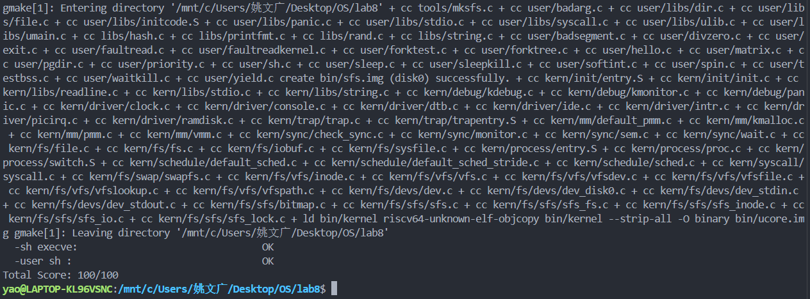

# 文件系统

小组成员：陈忠镇  姚文广  田子煊


## 实验目的

通过完成本次实验，希望能够达到以下目标

- 了解文件系统抽象层-VFS的设计与实现
- 了解基于索引节点组织方式的Simple FS文件系统与操作的设计与实现
- 了解“一切皆为文件”思想的设备文件设计
- 了解简单系统终端的实现


## 实验内容

实验七完成了在内核中的同步互斥实验。本次实验涉及的是文件系统，通过分析了解ucore文件系统的总体架构设计，完善读写文件操作(即实现sfs_io_nolock()函数)，重新实现基于文件系统的执行程序机制（即实现load_icode()函数），从而实现执行存储在磁盘上的文件以及文件读写等功能。

与实验七相比，实验八增加了文件系统，并因此实现了通过文件系统来加载可执行文件到内存中运行的功能，导致对进程管理相关的实现比较大的调整。


## 实验过程

### 练习1：完成读文件操作的实现（需要编码）

> 首先了解打开文件的处理流程，然后参考本实验后续的文件读写操作的过程分析，填写在 kern/fs/sfs/sfs_inode.c中 的sfs_io_nolock()函数，实现读文件中数据的代码。

在实现具体函数之前，首先梳理从用户态发起请求到最终磁盘操作的调用链路。

##### ***1.打开文件 (Open) 流程***

当用户进程调用 open 时，执行流如下：

- **用户态**：open(path, ...) 发起系统调用。
- **VFS 层**：sysfile_open -> file_open。在 file_open 中，内核分配一个新的 struct file，然后调用 vfs_open。
- **路径解析**：vfs_open 调用 vfs_lookup，进而调用 SFS 特定的 sfs_lookup。
- **SFS 层**：sfs_lookup -> sfs_lookup_once -> sfs_dirent_search_nolock。SFS 会读取目录的数据块，逐个匹配 sfs_disk_entry。
- **加载 Inode**：找到匹配的文件后，调用 sfs_load_inode 将磁盘上的 inode 信息加载到内存中，并建立 file 结构与 inode 的绑定关系，最终返回文件描述符 fd。

##### ***2.读写文件 (Read/Write) 流程***

当用户进程调用 read(fd, buf, len) 时，执行流如下：

- **用户态**：read -> sys_read -> syscall。
- **通用文件接口层**：sysfile_read。它负责循环读取，每次读取一部分（alen = min(len, IOBUF_SIZE)），并调用 copy_to_user 将内核缓冲区的数据搬运回用户空间。
- **文件抽象层**：file_read。通过 fd2file 找到对应的 struct file，初始化 iobuf 结构（记录读写进度），然后调用 vop_read。
- **VFS 多态分发**：vop_read 实际上是函数指针，指向 SFS 实现的 sfs_read。
- **SFS 层**：sfs_read -> sfs_io (加锁) -> **sfs_io_nolock** (核心逻辑)。
  - sfs_io_nolock 计算逻辑块号，调用 sfs_bmap_load_nolock 获取物理块号。
  - 通过 sfs_buf_op (部分块读写) 或 sfs_block_op (整块读写) 完成内存与磁盘块的数据交互。

##### ***3. sfs_io_nolock 设计思路***

sfs_io_nolock 的核心挑战在于：**磁盘读写以块（Block, 4KB）为单位，而用户请求是以字节为单位，且偏移量和长度任意。**

因此，我们需要将一次 I/O 请求分解为三个阶段（Head-Body-Tail）：

1. **头部非对齐部分 (Head)**：
   - 如果 offset % SFS_BLKSIZE != 0，说明起始位置在块的中间。
   - 需要处理从 offset 到该块结束（或请求结束位置）的数据。
   - 使用 sfs_buf_op（即 sfs_rbuf/sfs_wbuf）进行块内偏移读写。
2. **中间对齐块部分 (Body)**：
   - 处理完头部后，如果剩余数据量足以填满一个或多个完整的块。
   - 为了提高效率，直接使用 sfs_block_op（即 sfs_rblock/sfs_wblock）对整块进行操作，无需计算块内偏移。
3. **尾部非对齐部分 (Tail)**：
   - 处理完中间块后，如果 endpos 不在块边界上，说明最后一块只需要读写前面的一部分。
   - 同样使用 sfs_buf_op 处理剩余数据。

##### ***4.代码实现***

根据上述设计思路，在 kern/fs/sfs/sfs_inode.c 中完善代码如下：

```c
static int
sfs_io_nolock(struct sfs_fs *sfs, struct sfs_inode *sin, void *buf, off_t offset, size_t *alenp, bool write) {
    struct sfs_disk_inode *din = sin->din;
    assert(din->type != SFS_TYPE_DIR);
    off_t endpos = offset + *alenp, blkoff;
    *alenp = 0;

    // ... (省略部分参数检查和函数指针赋值代码，如 sfs_buf_op, sfs_block_op) ...
    int ret = 0;
    size_t size, alen = 0;
    uint32_t ino;
    uint32_t blkno = offset / SFS_BLKSIZE;          // 起始块号
    uint32_t nblks = endpos / SFS_BLKSIZE - blkno;  // 涉及的完整块数量
    
    // -----------------------------------------------------------
    // 第一步：处理起始处未对齐的数据 (Head)
    // -----------------------------------------------------------
    // 计算偏移量在块内的偏移
    blkoff = offset % SFS_BLKSIZE;

    // 如果 blkoff 不为 0，说明起始位置不在块边界，需要先处理这个不完整的块
    if (blkoff != 0) {
        // 计算这一部分需要读写的大小：
        // 如果 nblks != 0，说明后面还有块，读取到当前块末尾 (SFS_BLKSIZE - blkoff)
        // 如果 nblks == 0，说明所有数据都在这一块内，读取到 endpos (endpos - offset)
        size = (nblks != 0) ? (SFS_BLKSIZE - blkoff) : (endpos - offset);

        // 获取逻辑块对应的物理磁盘块号 (ino)
        if ((ret = sfs_bmap_load_nolock(sfs, sin, blkno, &ino)) != 0) {
            goto out;
        }
        // 执行部分读/写操作 (使用 sfs_buf_op)
        if ((ret = sfs_buf_op(sfs, buf, size, ino, blkoff)) != 0) {
            goto out;
        }
        // 更新累计处理长度、缓冲区指针
        alen += size;
        buf += size;
        // 如果只有这一块需要处理（没有后续整块），则处理完毕
        if (nblks == 0) {
            goto out;
        }        
        // 头部处理完毕，逻辑块号 +1，剩余完整块数量 -1
        blkno++;
        nblks--;
    }
    // -----------------------------------------------------------
    // 第二步：处理中间完整对齐的块 (Body)
    // -----------------------------------------------------------
    // 此时 buf 已经对齐，且每次处理一个完整的 SFS_BLKSIZE
    size = SFS_BLKSIZE;
    while (nblks > 0) {
        // 获取物理块号
        if ((ret = sfs_bmap_load_nolock(sfs, sin, blkno, &ino)) != 0) {
            goto out;
        }        
        // 对整块进行读/写操作 (使用 sfs_block_op，效率更高)
        if ((ret = sfs_block_op(sfs, buf, ino, 1)) != 0) {
            goto out;
        }       
        // 更新状态
        alen += size;
        buf += size;
        blkno++;
        nblks--;
    }
    // -----------------------------------------------------------
    // 第三步：处理末尾未对齐的数据 (Tail)
    // -----------------------------------------------------------
    // 计算结束位置在最后一块中的偏移量
    blkoff = endpos % SFS_BLKSIZE;
    
    // 如果 blkoff != 0，说明最后一块不是整块，需要读写前半部分
    if (blkoff != 0) {
        size = blkoff; // 大小就是从块头开始的偏移量        
        if ((ret = sfs_bmap_load_nolock(sfs, sin, blkno, &ino)) != 0) {
            goto out;
        }        
        // 注意：这里的 offset 参数为 0，因为是从该块的起始位置开始操作
        if ((ret = sfs_buf_op(sfs, buf, size, ino, 0)) != 0) {
            goto out;
        }
        alen += size;
    }
out:
    *alenp = alen;
    if (offset + alen > sin->din->size) {
        sin->din->size = offset + alen;
        sin->dirty = 1;
    }
    return ret;
}
```

***实现细节分析***

- **地址映射 (sfs_bmap_load_nolock)**：
  在读写过程中，我们只关心文件的**逻辑块号**。通过调用 sfs_bmap_load_nolock，系统会自动查找 inode 的直接索引或间接索引表，将逻辑块号映射为磁盘上的**物理块号**。如果是写操作且该块尚未分配，该函数还会负责分配新块并更新 inode。
- **操作函数的选择**：
  代码中利用了函数指针 sfs_buf_op 和 sfs_block_op 来复用读和写的逻辑。
  - 对于头部和尾部的非对齐部分，使用 sfs_buf_op（指向 sfs_rbuf 或 sfs_wbuf），它可以指定块内的 offset 和 len。
  - 对于中间的完整块，使用 sfs_block_op（指向 sfs_rblock 或 sfs_wblock），直接对整个块进行 I/O，避免了不必要的偏移计算，提高了效率。
- **边界条件判断**：
  在处理头部时，必须判断 nblks 是否为 0。如果请求的数据量很小，连第一个块都没填满（即 offset 和 endpos 在同一个块内），代码会在头部处理完后直接通过 goto out 结束，不会错误地进入后续逻辑。


### 练习2：完成基于文件系统的执行程序机制的实现（需要编码）

> 改写proc.c中的load_icode函数和其他相关函数，实现基于文件系统的执行程序机制。执行：make qemu。如果能看看到sh用户程序的执行界面，则基本成功了。如果在sh用户界面上可以执行`exit`, `hello`（更多用户程序放在`user`目录下）等其他放置在`sfs`文件系统中的其他执行程序，则可以认为本实验基本成功。

在 Lab 5 中，load_icode 直接操作内存中的二进制数据。引入文件系统后，核心逻辑发生如下变更：

1. **数据源抽象化**：
   程序不再是内存中的一段连续 buffer，而是磁盘上的文件。我们需要通过**文件描述符 (fd)** 来操作它。为了适配 ELF 解析过程中对文件不同位置（如文件头、程序头表、数据段）的随机访问需求，我们设计了 load_icode_read 辅助函数。
2. **按需加载与映射**：
   解析 ELF Header 和 Program Header，仅加载类型为 ELF_PT_LOAD 的段。根据段的属性（读/写/执行）设置虚拟内存权限，并逐页分配物理内存，从文件中读取对应的数据块填充页面。
3. **用户栈的预计算构建**：
   为了传递参数，代码采用“**先计算总大小，再一次性布局**”的策略。首先遍历所有参数字符串计算所需空间，然后计算栈顶指针位置，最后将字符串内容和指针数组写入用户栈。

##### *1. 辅助函数：load_icode_read*

该函数是文件系统接口与加载器之间的桥梁。

```c
static int load_icode_read(int fd, void *buf, size_t len, off_t offset) {
    int ret;
    // 1. 定位：将文件游标移动到指定的 offset
    if ((ret = sysfile_seek(fd, offset, LSEEK_SET)) != 0) {
        return ret;
    }
    // 2. 读取：从当前位置读取 len 字节到 buf
    if ((ret = sysfile_read(fd, buf, len)) != len) {
        return (ret < 0) ? ret : -1;
    }
    return 0;
}
```

**分析**：

- **功能**：模拟了直接内存访问。ELF 解析器通常需要跳转到文件的不同位置（例如从 header 跳转到 program header table，再跳转到具体代码段）。
- **健壮性**：严格检查 sysfile_seek 和 sysfile_read 的返回值，确保数据读取的完整性，防止因读取截断导致程序崩溃。

##### *2. 核心加载器：load_icode*

该函数完成了从创建新内存空间到跳转用户态的全过程。

**第一阶段：环境初始化与 ELF 解析**

```c
// 1. 创建内存管理结构 mm_struct
struct mm_struct *mm = mm_create();
// 2. 初始化页目录表 (Page Directory)
setup_pgdir(mm);
// 3. 读取并校验 ELF 头
struct elfhdr elf;
load_icode_read(fd, &elf, sizeof(struct elfhdr), 0);
if (elf.e_magic != ELF_MAGIC) goto bad...;
```

**分析**：

- 首先为当前进程创建一个全新的内存环境（mm），此时它是一个空的容器。
- 通过 load_icode_read 读取文件开头的 ELF Header，校验魔数 ELF_MAGIC 确保文件格式合法。

**第二阶段：段加载与内存映射**

这是函数的主体部分，负责将代码段（Text）和数据段（Data）加载到内存。

```c
for (uint32_t i = 0; i < elf.e_phnum; i++) {
    // 读取 Program Header
    load_icode_read(fd, &ph, sizeof(struct proghdr), phoff);

    if (ph.p_type == ELF_PT_LOAD) {
        // A. 权限位转换：ELF flags -> VMA flags -> PTE bits
        uint32_t vm_flags = 0, perm = PTE_U | PTE_V;
        if (ph.p_flags & ELF_PF_X) vm_flags |= VM_EXEC;
        // ... (转换逻辑略) ...

        // B. 建立虚拟内存映射 (VMA)
        mm_map(mm, ph.p_va, ph.p_memsz, vm_flags, NULL);

        // C. 物理内存分配与数据拷贝
        off_t offset = ph.p_offset;
        uintptr_t start = ph.p_va;
        uintptr_t end = ph.p_va + ph.p_filesz;

        while (start < end) {
            // 按页向下取整，处理非对齐地址
            uintptr_t la = ROUNDDOWN(start, PGSIZE);
            // 分配物理页
            struct Page *page = pgdir_alloc_page(mm->pgdir, la, perm);
            
            // 计算本次读取的大小 (处理页内偏移和段尾)
            size_t off = start - la;
            size_t size = PGSIZE - off;
            if (end < la + PGSIZE) size -= (la + PGSIZE - end);

            // 从文件读取数据到物理页的对应位置
            load_icode_read(fd, page2kva(page) + off, size, offset);
            
            start += size;
            offset += size;
        }
    }
}
```

**分析**：

1. **虚拟地址映射**：mm_map 负责在内核的 VMA 链表中登记该段的虚拟地址范围（p_va 到 p_va + p_memsz）及其权限。
2. **物理页分配**：while 循环处理了跨页加载的情况。
   - 利用 ROUNDDOWN 找到页面起始地址。
   - pgdir_alloc_page 分配物理页并在页表中建立映射。
   - page2kva(page) + off 计算出物理页在内核中的虚拟地址，以便 sysfile_read 写入数据。

**第三阶段：资源清理**

```c
// 6. 关闭文件
sysfile_close(fd);
```

**分析**：

- 文件内容加载完毕后，文件描述符 fd 不再需要。在此处关闭文件是一个良好的资源管理习惯，防止文件描述符泄漏。

**第四阶段：用户栈构建**

为了支持参数传递，代码在用户栈顶（USTACKTOP）构建了符合 ABI 的数据结构。

```C
// 7. 建立用户栈 VMA 并分配物理页
mm_map(mm, USTACKTOP - USTACKSIZE, USTACKSIZE, VM_READ|VM_WRITE|VM_STACK, NULL);
// 预分配 4 页物理内存
for (int i = 1; i <= 4; i++) pgdir_alloc_page(...);

// 9. 设置命令行参数
// A. 计算参数总长度
uint32_t argv_size = 0;
for (int i = 0; i < argc; i++) {
    argv_size += strnlen(kargv[i], EXEC_MAX_ARG_LEN + 1) + 1;
}

// B. 计算栈顶位置 (预留空间)
// 这里的 sizeof(long) 保证了基本的指针对齐
uintptr_t stacktop = USTACKTOP - (argv_size / sizeof(long) + 1) * sizeof(long);

// C. 计算 argv 指针数组的起始位置
char **uargv = (char **)(stacktop - argc * sizeof(char *));

// D. 拷贝字符串并设置指针
argv_size = 0;
for (int i = 0; i < argc; i++) {
    uargv[i] = strcpy((char *)(stacktop + argv_size), kargv[i]); // 拷贝字符串
    argv_size += strnlen(kargv[i], EXEC_MAX_ARG_LEN + 1) + 1;
}

// E. 压入 argc
stacktop = (uintptr_t)uargv - sizeof(int);
*(int *)stacktop = argc;
```

**分析**：

- **策略**：采用“预计算”策略。先遍历 kargv 算出所有字符串的总长度，从而确定栈顶 stacktop 应该下移多少。
- **布局**：构建后的栈结构从高地址到低地址依次为：
  - 参数字符串内容（例如 "ls\0", "-l\0"）
  - argv 指针数组（指向上述字符串）
  - argc 数值
- **对齐**：代码中使用 sizeof(long) 进行基本的对齐处理，确保指针访问的合法性。

**第五阶段：上下文切换准备**

```c
// 8. 激活新内存空间
mm_count_inc(mm);
current->mm = mm;
current->cr3 = PADDR(mm->pgdir);
lcr3(PADDR(mm->pgdir)); // 切换页表寄存器 (x86: cr3, RISC-V: satp)

// 10. 设置 Trapframe
struct trapframe *tf = current->tf;
tf->gpr.sp = stacktop;     // 设置新栈顶
tf->epc = elf.e_entry;     // 设置程序入口点
tf->status &= ~SSTATUS_SPP; // 清除内核权限位
```

**分析**：

- **页表切换**：lcr3（或 RISC-V 下的 lsatp）指令执行后，当前进程的地址空间正式切换为新程序的地址空间。
- **Trapframe**：修改 sp 和 epc，确保当内核从系统调用返回（iret 或 sret）时，CPU 跳转到 ELF 文件的入口点，且使用我们刚刚构建好的包含参数的用户栈。

**结果验证：**




### 扩展练习Challenge1：完成基于“UNIX的PIPE机制”的设计方案

> 如果要在ucore里加入UNIX的管道（Pipe）机制，至少需要定义哪些数据结构和接口？（接口给出语义即可，不必具体实现。数据结构的设计应当给出一个（或多个）具体的C语言struct定义。在网络上查找相关的Linux资料和实现，请在实验报告中给出设计实现”UNIX的PIPE机制“的概要设方案，你的设计应当体现出对可能出现的同步互斥问题的处理。）

#### ***设计方案***

在 uCore 中实现 Pipe，核心思想是将管道视为一种**特殊的文件**。它不对应磁盘上的物理块，而是对应内核中的一段内存缓冲区。

- **VFS 集成**：利用 uCore 现有的虚拟文件系统（VFS）接口。当用户调用 pipe() 系统调用时，内核创建两个 struct file（文件描述符），分别对应管道的**读端**和**写端**。这两个文件描述符指向同一个 struct inode。
- **内存管理**：该 inode 内部维护一个内核缓冲区（通常为一页大小，如 4KB）。
- **通信机制**：数据流向是单向的（在 uCore 简单实现中）或双向的，通常遵循 FIFO（先进先出）原则。写进程向缓冲区写入字节流，读进程从缓冲区读取字节流。
- **环形缓冲**：为了高效利用内存，使用环形队列（Ring Buffer）管理数据。

#### ***数据结构定义***

我们需要定义一个核心结构体来维护管道的状态。这个结构体通常会作为 inode 的私有数据（inode->device_info 或类似的 void * 指针）存在。

```c
#include <defs.h>
#include <list.h>
#include <sem.h>
#include <wait.h>

// 定义管道缓冲区的大小，通常与页大小对齐，例如 4096 字节
#define PIPE_SIZE  4096

/* 
 * 管道的核心控制结构体 
 * 该结构体将被关联到 inode 上
 */
struct pipe_state {
    // ---- 缓冲区管理 ----
    char *buffer;             // 指向内核缓冲区的指针 (kmalloc分配)
    off_t head;               // 写入位置指针 (Write Pointer)
    off_t tail;               // 读取位置指针 (Read Pointer)
    bool is_full;             // 缓冲区是否已满的标记 (辅助判断环形队列状态)

    // ---- 引用计数 ----
    unsigned int readers;     // 当前打开此管道读端的文件描述符数量
    unsigned int writers;     // 当前打开此管道写端的文件描述符数量

    // ---- 同步与互斥 ----
    // 保护缓冲区操作的互斥锁 (或二值信号量)
    semaphore_t mutex;        

    // 读者等待队列：当缓冲区为空时，读进程在此等待
    wait_queue_t wait_reader; 

    // 写者等待队列：当缓冲区已满时，写进程在此等待
    wait_queue_t wait_writer; 
    
    // 标记管道是否已经损坏（例如写端全部关闭，读端读到EOF）
    bool is_closed;
};

/* 
 * 扩展 uCore 的 inode 或 file 结构 (概念性)
 * 在创建 pipe 时，我们需要区分返回的两个 fd 哪个是读，哪个是写。
 * 这通常通过 file->open_flags (O_RDONLY / O_WRONLY) 来区分。
 */
```

#### ***接口语义定义***

我们需要实现一组标准的文件操作接口，这些接口将挂载到 uCore 的 VFS 层。

##### **1. 创建管道接口**

- **名称**: pipe_open (或者在 sys_pipe 中直接实现)
- **语义**:
  1. 分配一个新的 struct pipe_state。
  2. 申请 PIPE_SIZE 大小的内核内存作为缓冲区。
  3. 初始化 head, tail 为 0，初始化信号量和等待队列。
  4. 创建两个 struct file 对象：
     - File A (读端): 标志位设为 O_RDONLY，关联到上述管道对象。
     - File B (写端): 标志位设为 O_WRONLY，关联到上述管道对象。
  5. 将 readers 和 writers 计数初始化为 1。

##### **2. 读取接口**

- **名称**: pipe_read
- **参数**: struct file *file (管道文件), void *buf (用户缓冲区), size_t len (请求读取长度)
- **语义**:
  - **非阻塞情况**: 如果管道有数据，读取 min(len, available_bytes) 到用户 buffer，更新 tail 指针，唤醒休眠的写者（因为有了空闲空间），返回读取字节数。
  - **阻塞情况**: 如果管道为空：
    - 如果 writers == 0 (没有写者了)，返回 0 (EOF)。
    - 如果 writers > 0，将当前进程加入 wait_reader 队列并让出 CPU，直到被唤醒。

##### **3. 写入接口**

- **名称**: pipe_write
- **参数**: struct file *file, const void *buf, size_t len
- **语义**:
  - **基本逻辑**: 将用户数据写入环形缓冲区 head 处。
  - **边界情况**:
    - 如果 readers == 0 (读端均已关闭)，写入操作应当触发 SIGPIPE 信号或返回 E_PIPE 错误。
  - **阻塞情况**: 如果缓冲区已满：
    - 将当前进程加入 wait_writer 队列并让出 CPU，直到有空间被腾出。
  - **原子性**: 如果写入数据量小于 PIPE_BUF (通常 4KB)，Linux 保证写入是原子的（不会被其他进程的写入打断插队）；否则可能发生交错。

##### **4. 关闭接口**

- **名称**: pipe_close
- **参数**: struct file *file
- **语义**:
  1. 根据 file 是读端还是写端，递减 readers 或 writers 计数。
  2. **状态变更通知**:
     - 如果这是最后一个写端关闭 (writers 变为 0)，唤醒所有在该管道上等待的读进程（让它们读到 EOF）。
     - 如果这是最后一个读端关闭 (readers 变为 0)，唤醒所有在该管道上等待的写进程（让它们发现错误并退出）。
  3. **资源回收**: 当 readers == 0 且 writers == 0 时，释放 buffer 内存和 pipe_state 结构体。

#### ***同步与互斥的具体处理方案***

> 在多进程环境下，管道可能面临以下并发场景：
>
> 1. **多写者/多读者**：父进程 fork 出子进程后，可能有多个进程持有同一个管道的写端或读端。
> 2. **读写追逐**：写进程正在写入数据时，读进程同时尝试读取。
> 3. **缓冲区满/空**：写进程写入速度快于读进程导致缓冲区满，或反之导致缓冲区空。
> 4. **端点关闭**：读写过程中，另一端突然关闭。

##### **1. 核心同步机制**

我们使用 **互斥锁** 配合 **条件变量（Condition Variable，在 uCore 中通过等待队列 wait_queue 实现）** 来解决上述问题。

- **互斥锁**：
  - **作用**：保护临界区资源，包括缓冲区的内存内容 (buffer)、读写指针 (head/tail)、引用计数 (readers/writers) 以及状态标记 (is_full)。
  - **粒度**：任何对 pipe_state 结构的修改或读取前，必须先持有该锁。
- **等待队列**：
  - **作用**：实现进程的阻塞与唤醒。
  - **逻辑**：
    - wait_reader：当缓冲区为空时，读进程在此队列休眠；当写进程写入数据后，唤醒此队列。
    - wait_writer：当缓冲区为满时，写进程在此队列休眠；当读进程取走数据后，唤醒此队列。

##### **2. 详细流程设计**

###### **A. pipe_read 的同步互斥逻辑**

读操作必须处理“缓冲区为空”的阻塞情况，以及“写端全部关闭”的 EOF 情况。

```c
size_t pipe_read(struct file *file, void *buf, size_t len) {
    struct pipe_state *pipe = file->private_data;
    size_t bytes_read = 0;

    // 1. 获取互斥锁，进入临界区
    down(&(pipe->mutex));
    while (1) {
        // 计算当前可读字节数
        size_t available = (pipe->head - pipe->tail + PIPE_SIZE) % PIPE_SIZE;
        // 注意：需结合 is_full 标记准确判断，这里简化处理环形计算
        if (available > 0) {
            // Case 1: 有数据可读
            // 开始读取数据（可能分两段复制，处理环形回绕）
            // copy_from_kernel(buf, pipe->buffer + tail, chunk_size);
            
            // 更新 tail 指针
            pipe->tail = (pipe->tail + chunk_size) % PIPE_SIZE;
            pipe->is_full = 0; // 读走了数据，肯定不满

            // 关键点：读走了数据，腾出了空间，必须唤醒可能正在等待的写者
            wakeup_queue(&(pipe->wait_writer));
            
            bytes_read = chunk_size;
            break; // 退出循环，准备返回
        } 
        else {
            // Case 2: 缓冲区为空
            if (pipe->writers == 0) {
                // Case 2.1: 所有的写端都关闭了，且无数据可读 -> 返回 EOF (0)
                bytes_read = 0;
                break; 
            }            
            // Case 2.2: 还有写者，只是暂时没数据 -> 阻塞等待
            // 必须在睡眠前释放锁，否则写者无法获取锁来写入数据，会造成死锁
            up(&(pipe->mutex));             
            // 将当前进程加入读等待队列，并将状态设为 SLEEPING
            wait_current_set(&(pipe->wait_reader), PROC_SLEEPING);
            schedule(); // 让出 CPU            
            // 被唤醒后，重新获取锁，再次进入 while 循环检查状态
            // 因为可能唤醒后数据又被别的读者抢走了，所以必须 loop check
            down(&(pipe->mutex));
        }
    }
    // 3. 释放互斥锁
    up(&(pipe->mutex));
    return bytes_read;
}
```

###### **B. pipe_write 的同步互斥逻辑**

写操作主要处理“缓冲区满”的阻塞情况，以及“读端关闭”的异常情况。

```c
size_t pipe_write(struct file *file, const void *buf, size_t len) {
    struct pipe_state *pipe = file->private_data;
    size_t bytes_written = 0;
    // 1. 获取互斥锁
    down(&(pipe->mutex));
    // 检查是否有读者，如果没有，视为 Broken Pipe
    if (pipe->readers == 0) {
        up(&(pipe->mutex));
        return -E_PIPE; // 或者发送 SIGPIPE 信号
    }
    while (len > 0) {
        // 计算剩余空间
        size_t space = ...; // 根据 head, tail 和 PIPE_SIZE 计算
        if (space == 0) {
            // Case 1: 缓冲区已满
            // 唤醒读者（以防万一），释放锁，进入睡眠
            wakeup_queue(&(pipe->wait_reader)); 
            up(&(pipe->mutex));            
            wait_current_set(&(pipe->wait_writer), PROC_SLEEPING);
            schedule();            
            // 醒来后重试
            down(&(pipe->mutex));            
            // 再次检查读者是否存在
            if (pipe->readers == 0) {
                up(&(pipe->mutex));
                return -E_PIPE;
            }
            continue;
        }
        // Case 2: 有空间写入
        // 如果写入数据量 <= PIPE_BUF (4KB)，即使空间不够一次写完，
        // Linux 语义通常要求原子写入。
        // 在 uCore 简单实现中，我们尽可能写入 min(len, space)       
        // copy_to_kernel(pipe->buffer + head, buf, chunk);       
        // 更新 head 指针
        pipe->head = (pipe->head + chunk) % PIPE_SIZE;
        if (pipe->head == pipe->tail) pipe->is_full = 1;
        // 关键点：写入了数据，唤醒等待的读者
        wakeup_queue(&(pipe->wait_reader));
        len -= chunk;
        buf += chunk;
        bytes_written += chunk;
    }

    // 3. 释放锁
    up(&(pipe->mutex));
    return bytes_written;
}
```


### 扩展练习Challenge2：完成基于“UNIX的软连接和硬连接机制”的设计方案

> 如果要在ucore里加入UNIX的软连接和硬连接机制，至少需要定义哪些数据结构和接口？（接口给出语义即可，不必具体实现。数据结构的设计应当给出一个（或多个）具体的C语言struct定义。在网络上查找相关的Linux资料和实现，请在实验报告中给出设计实现”UNIX的软连接和硬连接机制“的概要设方案，你的设计应当体现出对可能出现的同步互斥问题的处理。）

#### ***设计方案***

##### **1. 核心概念区分**

- **硬链接：本质上是同一个文件实体（Inode）在目录树中通过不同的文件名（Directory Entry）被引用多次。
  - **实现关键**：不创建新的 Inode，仅在目录项中增加记录，并增加 Inode 内部的引用计数 (nlinks)。文件只有在 nlinks 降为 0 时才被真正删除。
- **软链接**：是一个独立的文件，拥有自己的 Inode。
  - **实现关键**：其文件类型特殊（SFS_TYPE_LINK），文件内容不是普通数据，而是指向另一个文件的**路径字符串**。内核在解析路径时，如果遇到软链接，需要读取其内容并替换当前路径继续查找。

##### **2. SFS 文件系统改造思路**

目前 uCore 的 SFS 系统相对简单，通常 nlinks 默认为 1。支持链接机制需要：

1. **元数据扩展**：在磁盘 inode 中显式维护链接计数。
2. **类型扩展**：增加“链接文件”的类型标识。
3. **路径解析逻辑变更**：vfs_lookup 过程需要能够识别并跟随软链接（Follow Symlinks），同时防止死循环。

#### ***数据结构定义***

我们需要修改 SFS 的磁盘索引节点结构，并在内存中定义相关的控制结构。

##### **1. 磁盘索引节点**

修改 kern/fs/sfs/sfs.h 中的 sfs_disk_inode。虽然 uCore 原版可能已经保留了 nlinks 字段，但我们需要明确其定义和用途。

```c
/* sfs_disk_inode 修改与补充 */

// 文件类型定义补充
#define SFS_TYPE_INVAL  0       // 无效
#define SFS_TYPE_FILE   1       // 普通文件
#define SFS_TYPE_DIR    2       // 目录
#define SFS_TYPE_LINK   3       // 【新增】符号链接 (Soft Link)

struct sfs_disk_inode {
    uint32_t size;              // 文件大小 (对于软链接，这里是目标路径字符串的长度)
    uint16_t type;              // 文件类型 (FILE, DIR, or LINK)
    uint16_t nlinks;            // 【关键】硬链接计数。
                                // 创建硬链接时 +1，unlink 时 -1。
                                // 当 nlinks == 0 且无进程打开时，回收 block。
    uint32_t blocks;            // 占用的块数
    uint32_t direct[SFS_NDIRECT]; // 直接索引块
    uint32_t indirect;          // 间接索引块
    // ... 其他 padding
};
```

##### **2. 内存索引节点**

内存中的 sfs_inode 需要与磁盘结构保持一致，并可能需要辅助字段。

```c
/* kern/fs/sfs/sfs_inode.c 或相关头文件 */

struct sfs_inode {
    struct sfs_disk_inode *din; // 指向磁盘 inode 的副本
    uint32_t ino;               // inode 编号
    bool dirty;                 // 是否需要回写磁盘
    int reclaim_count;          // 内存中引用此 inode 的进程数 (open count)
    semaphore_t sem;            // 读写信号量 (互斥锁)
    list_entry_t inode_link;    // 用于 inode哈希链表
    list_entry_t hash_link;     // 用于 inode哈希链表
};
```

##### **3. VFS 层路径查找控制**

为了防止软链接循环（例如 A 指向 B，B 指向 A），需要在查找上下文中限制递归深度。

```c
/* 路径查找时的控制参数 */
#define MAX_SYMLINK_DEPTH 8    // 最大软链接递归深度

/* 可能会修改 vop_lookup 的参数或在 thread_struct 中增加状态 */
// 这里不需要显式 struct，但在实现逻辑中需维护一个 depth 计数器
```

#### ***接口语义定义***

我们需要在 VFS 层和系统调用层添加以下接口。

**1. 创建硬链接**

- **接口**: int sys_link(const char *oldpath, const char *newpath)
- **语义**:
  1. 解析 oldpath，找到其对应的 Inode。
  2. 检查 oldpath 是否为目录（通常禁止对目录建立硬链接以避免环路）。
  3. 检查 oldpath 和 newpath 是否在同一个文件系统内（硬链接不能跨文件系统）。
  4. 解析 newpath 的父目录，并在该目录下创建一个新的目录项（Directory Entry）。
  5. 新目录项的 inode 编号指向 oldpath 的 inode 编号。
  6. **原子操作**：将该 Inode 的 nlinks 加 1，并标记为 dirty。

**2. 创建软链接**

- **接口**: int sys_symlink(const char *target, const char *linkpath)
- **语义**:
  1. 解析 linkpath 的父目录。
  2. 分配一个新的 Inode，类型设为 SFS_TYPE_LINK。
  3. 将 target 字符串的内容写入新 Inode 的数据块中。
  4. 在 linkpath 父目录下创建新目录项，指向这个新 Inode。
  5. 注意：target 路径是否存在并不影响软链接的创建（允许悬空链接）。

**3. 删除链接**

- **接口**: int sys_unlink(const char *path)
- **语义**:
  1. 解析 path，找到父目录和目标 Inode。
  2. 从父目录中删除对应的目录项。
  3. **原子操作**：将目标 Inode 的 nlinks 减 1。
  4. 如果 nlinks 变为 0 且内存引用计数 (reclaim_count) 也为 0，则真正释放 Inode 及其占用的数据块；否则仅更新元数据。

**4. 读取软链接内容**

- **接口**: int sys_readlink(const char *path, char *buf, size_t bufsiz)
- **语义**:
  1. 解析 path，找到对应的 Inode。
  2. 检查 Inode 类型是否为 SFS_TYPE_LINK，如果不是则报错。
  3. 从 Inode 的数据块中读取内容（即目标路径）到用户提供的 buf 中。
  4. 注意：readlink **不**跟随链接，它只读取链接本身的内容。

***同步与互斥的具体处理方案***

引入链接机制后，文件系统的拓扑结构从“树”变成了“有向图”（软链接）甚至局部“网状”（硬链接）。这带来了新的并发挑战：

1. **硬链接计数竞态**：多个进程同时对同一文件创建硬链接或删除链接，导致 nlinks 计数错误，从而引发文件过早删除或空间泄漏。
2. **延迟删除问题**：当一个文件被删除时，如果仍有进程打开该文件，物理数据不能立即释放，必须等到最后一个进程关闭文件。
3. **目录项与 Inode 的不一致**：在创建链接时，需要在目录块中写入新项并在 Inode 中增加计数，这两个操作必须原子化，否则可能导致“有目录项无 Inode”或“有 Inode 无目录项”的损坏状态。

##### **1. 核心同步机制**

利用 uCore SFS 中已有的 inode->sem（作为互斥锁）以及内存引用计数机制。

- **Inode 锁**：
  - **作用**：保护 Inode 的元数据（尤其是 nlinks）和内容不被并发修改。
  - **粒度**：对单个文件的属性修改必须持有该锁。
- **目录锁**：
  - 在 SFS 中，目录也是一种文件。对目录项（Directory Entry）的增删改查，实质上是对目录 Inode 的写操作，因此需要持有**父目录 Inode 的锁**。

##### **2. 详细流程设计**

###### **A. sys_link (创建硬链接) 的同步逻辑**

**场景**：进程 A 执行 link("/a/old", "/b/new")。

1. **路径解析与锁定**：
   - 首先通过 vfs_lookup 找到源文件 /a/old 的 Inode (old_inode)。
   - 解析目标路径 /b/new 的父目录 /b 的 Inode (dir_inode)。
   - **死锁预防**：为了防止死锁，必须规定加锁顺序。通常建议**先锁目录，后锁目标文件**（或者按照 Inode 编号排序加锁，但 SFS 简单实现中通常串行化处理目录操作）。在此设计中，我们采用：
     1. 获取 dir_inode->sem（保护目录项写入）。
     2. 获取 old_inode->sem（保护引用计数更新）。
2. **原子更新**：
   - **检查**：在持有锁的情况下，再次确认 old_inode 没有被删除（nlinks > 0）。
   - **操作 1**：old_inode->nlinks++，标记 old_inode 为 dirty。
   - **操作 2**：在 dir_inode 的数据块中写入一个新的目录项 {name="new", ino=old_inode->ino}。
3. **解锁**：
   - 释放 old_inode->sem。
   - 释放 dir_inode->sem。

###### B. sys_unlink (删除链接) 与 延迟删除

这是 UNIX 文件系统语义中最棘手的部分：**如何保证“删除正在使用的文件”是安全的？**

**设计方案**：
利用内存 Inode (sfs_inode) 中的 reclaim_count (打开计数) 和磁盘 Inode (sfs_disk_inode) 中的 nlinks (硬链接计数) 共同决定物理释放时机。

1. **Unlink 操作流程**：
   - 获取父目录锁 dir_inode->sem。
   - 获取目标文件锁 target_inode->sem。
   - **操作 1**：从父目录数据中清除目录项。
   - **操作 2**：target_inode->nlinks--，标记 dirty。
   - **判断释放**：
     - 如果 nlinks == 0：此时文件在文件系统命名空间中已消失。
     - **关键检查**：检查 target_inode->reclaim_count（内存中打开此文件的进程数）。
       - 如果 reclaim_count > 0：**不释放磁盘块**。只将更新后的 nlinks=0 写回磁盘。文件成为“孤儿文件”，但仍可读写。
       - 如果 reclaim_count == 0：**立即调用 sfs_truncate 释放磁盘块**，并释放 inode。
   - 释放锁。
2. **Close / Reclaim 操作流程**：
   - 当进程调用 close 导致 reclaim_count 减为 0 时，uCore VFS 会调用 vop_reclaim。
   - 在 sfs_reclaim 中：
     - 获取 inode->sem。
     - 检查 disk_inode->nlinks。
     - 如果 nlinks == 0：说明该文件之前已经被 unlink 过，且自己是最后一个持有者。**此时执行真正的磁盘空间释放操作**（Free blocks, Free inode）。
     - 释放锁。

###### C. sys_symlink 与 软链接解析

软链接的主要互斥问题在于**路径解析过程中的死循环**和**目录树变更**。

1. **死循环防护**：
   - 在 vfs_lookup 中维护一个递归计数器 link_count。
   - 每遇到一个 SFS_TYPE_LINK，link_count++。
   - 如果 link_count > MAX_SYMLINK_DEPTH (如 8)，停止解析并返回 ELOOP 错误。这不需要锁，只需要在函数调用栈中传递计数变量。
2. **解析一致性**：
   - 解析软链接内容需要读取其 Inode 的数据块。
   - 获取软链接 Inode 的锁 link_inode->sem，读取内容到内核缓冲区，释放锁。
   - 然后使用读取到的路径字符串重新发起 lookup。

##### 3. 特殊并发场景总结

| 场景                                         | 竞态风险                    | 处理方案                                                     |
| -------------------------------------------- | --------------------------- | ------------------------------------------------------------ |
| **A 进程硬链接文件 F，B 进程同时删除文件 F** | nlinks 计数可能错误         | 必须对 F 的 Inode 加互斥锁。A 和 B 串行执行。如果 B 先执行，A 发现目录中无 F 或 F 已被标记删除，则报错。 |
| **A 进程正在读文件 F，B 进程 unlink F**      | B 删除文件导致 A 读取非法块 | B 执行 unlink 时，只减 nlinks 至 0，但不释放物理块（因为 A 持有 reclaim_count）。A 继续正常读取。当 A 关闭文件时，触发真正的物理释放。 |
| **跨目录重命名/移动 (影响硬链接)**           | 目录树结构破坏              | 需同时持有源目录和目标目录的锁。为防死锁，可按 Inode 地址/编号大小顺序加锁。 |


